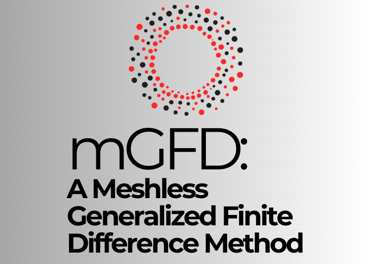

# mGFD: Meshless Generalized Finite Differences :triangular_ruler:

<div align="center">

[](https://github.com/gstinoco/mGFD) [](https://www.python.org/downloads/) [](https://numpy.org/) [](https://scipy.org/) [](https://opensource.org/licenses/MIT)



**Data and methods for numerically solving Partial Differential Equations using a meshless Generalized Finite Differences Scheme**

*Complete solution for numerical simulations on highly irregular regions*

### :link: Quick Links
[](#rocket-quick-start) [](#bulb-examples) [](#scientist-research-team)

</div>

---

## :clipboard: Table of Contents
- [Overview](#star2-overview)
- [Features](#sparkles-features)
- [Installation & Setup](#package-installation--setup)
- [Quick Start](#rocket-quick-start)
- [Examples](#bulb-examples)
- [Data](#open_file_folder-data)
- [Usage Guide](#book-usage-guide)
- [Project Architecture](#open_file_folder-project-architecture)
- [Contributing](#handshake-contributing)
- [Research Team](#scientist-research-team)
- [Citation & License](#memo-citation--license)
- [Contact](#email-contact--support)

---

## :star2: Overview

The **mGFD (meshless Generalized Finite Differences)** repository provides a comprehensive solution for numerically solving Partial Differential Equations in two dimensions on highly irregular regions. This advanced computational framework uses a Generalized Finite Differences Method for numerical solutions on unstructured clouds of points.

### :gear: Key Capabilities
- **:triangular_ruler: Meshless Method**: Advanced numerical solutions without traditional mesh generation
- **:world_map: Irregular Domains**: Handle complex geometries and highly irregular regions
- **:chart_with_upwards_trend: Multiple PDEs**: Support for various types of partial differential equations
- **:floppy_disk: Ready-to-use Data**: Pre-processed datasets for immediate testing
- **:microscope: High Accuracy**: Demonstrated high precision in numerical solutions

### :microscope: Supported Equations

| Equation Type | Application | Accuracy Range |
|---------------|-------------|----------------|
| **Poisson Equation** :zap: | Electrostatics, Heat Conduction | $10^{-6}$ - $10^{-7}$ |
| **Heat Equation** :fire: | Thermal Analysis, Diffusion | $10^{-7}$ - $10^{-8}$ |
| **Advection-Diffusion** :ocean: | Transport Phenomena | $10^{-6}$ - $10^{-7}$ |
| **Wave Equation** :sound: | Acoustics, Vibrations | $10^{-6}$ - $10^{-7}$ |

---

## :sparkles: Features

### :triangular_ruler: Numerical Methods
- **Generalized Finite Differences**: Advanced meshless discretization schemes
- **Unstructured Point Clouds**: Flexible point distribution for complex geometries
- **High-Order Accuracy**: Optimized stencils for improved precision
- **Adaptive Algorithms**: Automatic parameter adjustment for optimal performance

### :world_map: Domain Handling
- **Irregular Geometries**: Support for complex 2D domains
- **Boundary Conditions**: Flexible boundary condition implementation
- **Multi-region Support**: Handle domains with holes and multiple regions
- **Real-world Datasets**: Geographic and engineering domains

### :computer: Implementation
- **Pure Python**: Easy to understand and modify
- **Vectorized Operations**: Optimized NumPy and SciPy integration
- **Modular Design**: Clean separation of concerns
- **Comprehensive Documentation**: Well-documented code and examples

---

## :package: Installation & Setup

### :computer: System Requirements

| Component | Minimum | Recommended |
|-----------|---------|-------------|
| **Python** | 3.8+ | 3.9+ |
| **RAM** | 4 GB | 8 GB+ |
| **CPU** | 2 cores | 4+ cores |
| **Storage** | 500 MB | 2 GB+ |
| **OS** | Windows/Linux/macOS | Linux (optimal performance) |

### :package: Dependencies

The project uses the following main dependencies:

```python
# Scientific computing
numpy >= 1.20.0             # Numerical computations
scipy >= 1.7.0               # Scientific algorithms
matplotlib >= 3.5.0          # Visualization and plotting
pandas >= 1.3.0              # Data manipulation (optional)
```

### :wrench: Installation Steps

#### Method 1: Direct Installation
```bash
# Clone the repository
git clone https://github.com/gstinoco/mGFD.git
cd mGFD

# Install dependencies
pip install numpy scipy matplotlib
```

#### Method 2: Virtual Environment (Recommended)
```bash
# Create virtual environment
python -m venv mGFD_env
source mGFD_env/bin/activate  # On Windows: mGFD_env\Scripts\activate

# Clone and install
git clone https://github.com/gstinoco/mGFD.git
cd mGFD
pip install numpy scipy matplotlib
```

### :white_check_mark: Installation Verification

```bash
# Test installation
python -c "import numpy, scipy, matplotlib; print('✅ Installation successful!')"

# Run a quick test
python main.py
```

---

## :rocket: Quick Start

### 1. :arrow_forward: Basic Usage

```python
# Import the main module
import mGFD

# Load a dataset
p, tt = mGFD.load_data('TIT')  # Titicaca Lake

# Solve Poisson equation
solution = mGFD.solve_poisson(p, tt)

# Visualize results
mGFD.plot_solution(p, solution)
```

### 2. :gear: Advanced Configuration

```python
# Custom parameters
params = {
    'method': 'mGFD',
    'order': 2,
    'boundary_conditions': 'dirichlet'
}

# Solve with custom settings
solution = mGFD.solve_heat_equation(p, tt, params)
```

---

## :bulb: Examples

The repository includes comprehensive examples demonstrating the solution of various PDEs on irregular domains:

### Titicaca Lake Results

| Cloud of Points | Cloud with Holes |
| :--------------------------------------------------------------------------------------------------: | :--------------------------------------------------------------------------------------------------: |
|  |  |
|  |  |
| **Poisson Equation** ||
|  |  |
| $\mid\mid e\mid\mid = 2.577253005346005e-06$ | $\mid\mid e\mid\mid = 4.051923736734612e-06$ |
|  |  |
| **Heat Equation** ||
| <video src="https://github.com/gstinoco/mGFD/assets/111999346/bc58c6b8-3821-445c-9b00-e3f917c1e38f"> | <video src="https://github.com/gstinoco/mGFD/assets/111999346/fcbded0b-91b6-4937-adf4-1b2cc6c337af"> |
| $\mid\mid e\mid\mid = 2.772683874643615e-07$ | $\mid\mid e\mid\mid = 3.844963195258414e-07$ |
|  |  |
| **Advection-Diffusion Equation** ||
| <video src="https://github.com/gstinoco/mGFD/assets/111999346/f3ace4e7-de20-4420-a492-8bea4be77d9d"> | <video src="https://github.com/gstinoco/mGFD/assets/111999346/8226f148-2086-4dbe-85e5-597ba4ed8498"> |
| $\mid\mid e\mid\mid = 8.682520100538671e-07$ | $\mid\mid e\mid\mid = 5.293394861064519e-07$ |
|  |  |
| **Wave Equation** ||
| <video src="https://github.com/gstinoco/mGFD/assets/111999346/6060f485-475a-40e7-9528-d4b88bf8c3d3"> | <video src="https://github.com/gstinoco/mGFD/assets/111999346/7555e9c9-a396-4b0a-a646-8a0cd1111a6c"> |
| $\mid\mid e\mid\mid = 3.999132412126389e-06$ | $\mid\mid e\mid\mid = 4.584086365945307e-06$ |

---

## :open_file_folder: Data

All datasets are taken from the Author's [Cloud-Generation GitHub Repository](https://github.com/gstinoco/Cloud-Generation). The data is free for anyone to use to compare results using different methods with the same dataset.

### Available Regions

<div align="center">

| Code | Region | Location | Type |
|:----:|:-------|:---------|:-----|
| **BAN** | Banderas Bay | Mexico | Coastal |
| **BLU** | Blue Lagoon | Iceland | Geothermal |
| **CUA** | Unitary Square | Synthetic | Geometric |
| **CUI** | Cuitzeo Lake | Mexico | Lake |
| **ENG** | United Kingdom | Europe | Island |
| **GIB** | Strait of Gibraltar | Spain/Morocco | Strait |
| **HAB** | Havana Bay | Cuba | Bay |
| **MIC** | Michoacán State | Mexico | Administrative |
| **PAT** | Pátzcuaro Lake | Mexico | Lake |
| **TIT** | Titicaca Lake | South America | Lake |
| **TOB** | Toba Lake | Indonesia | Lake |
| **UCH** | Uchinskoye Reservoir | Russia | Reservoir |
| **VAL** | Valencia Lake | Spain | Lake |
| **ZIR** | Zirahuén Lake | Mexico | Lake |

</div>

### Data Structure

```
Data/
├── Clouds/          # Point clouds without holes
│   ├── [REGION]_p.csv    # Point coordinates
│   ├── [REGION]_tt.csv   # Triangulation data
│   └── [REGION].png      # Visualization
└── Holes/           # Point clouds with holes
    ├── [REGION]_p.csv    # Point coordinates
    ├── [REGION]_tt.csv   # Triangulation data
    └── [REGION].png      # Visualization
```

---

## :book: Usage Guide

### Running Examples

The codes are self-explained and completely documented. Examples on how to perform approximations can be found in the batch files:

#### Available Scripts

- **`batches/run_Poisson.py`**: Solve Poisson equation on all regions
- **`batches/run_Heat.py`**: Solve Heat equation on all regions  
- **`batches/run_AdvDif.py`**: Solve Advection-Diffusion equation on all regions
- **`batches/run_Wave.py`**: Solve Wave equation on all regions

#### Example Usage

```bash
# Run Poisson equation examples
python batches/run_Poisson.py

# Run Heat equation examples
python batches/run_Heat.py

# Run Advection-Diffusion examples
python batches/run_AdvDif.py

# Run Wave equation examples
python batches/run_Wave.py
```

### Customization

These examples can be easily modified to perform approximations with different conditions and coefficients. The modular design allows for:

- **Custom Boundary Conditions**: Modify boundary condition functions
- **Different Coefficients**: Adjust PDE coefficients
- **Alternative Domains**: Use your own point cloud data
- **Parameter Tuning**: Optimize solver parameters

---

## :open_file_folder: Project Architecture

```
mGFD/
├── 📄 mGFD.py                   # Main module with core algorithms
├── 📄 main.py                   # Example usage and testing
├── 📄 LICENSE                   # MIT License
├── 📄 README.md                 # This documentation
├── 📁 Data/                     # Datasets
│   ├── 📁 Clouds/               # Point clouds without holes
│   └── 📁 Holes/                # Point clouds with holes
├── 📁 Results/                  # Generated solutions
│   ├── 📁 Clouds/               # Results for clouds
│   └── 📁 Holes/                # Results for holes
├── 📁 Scripts/                  # Utility scripts
│   ├── 📄 Errors.py             # Error analysis
│   ├── 📄 Gammas.py             # Gamma coefficient computation
│   ├── 📄 Graph.py              # Visualization utilities
│   └── 📄 Neighbors.py          # Neighbor finding algorithms
└── 📁 batches/                  # Example scripts
    ├── 📄 run_Poisson.py        # Poisson equation examples
    ├── 📄 run_Heat.py           # Heat equation examples
    ├── 📄 run_AdvDif.py         # Advection-Diffusion examples
    └── 📄 run_Wave.py           # Wave equation examples
```

---

## :handshake: Contributing

We welcome contributions from the research community! Here's how you can help:

### :bug: Bug Reports
1. **Search Existing Issues**: Check if the bug has been reported
2. **Create Detailed Report**: Include steps to reproduce, expected vs actual behavior
3. **Provide Context**: Operating system, Python version, NumPy/SciPy versions
4. **Include Data**: Attach relevant input files if applicable

### :bulb: Feature Requests
1. **Describe the Feature**: Clear description of the proposed functionality
2. **Justify the Need**: Explain how it benefits the research community
3. **Provide Examples**: Include use cases and expected behavior
4. **Consider Implementation**: Suggest possible approaches if applicable

### :computer: Code Contributions

#### Development Setup
```bash
# Fork the repository
git clone https://github.com/yourusername/mGFD.git
cd mGFD

# Create development environment
python -m venv dev_env
source dev_env/bin/activate
pip install numpy scipy matplotlib

# Create feature branch
git checkout -b feature/your-feature-name
```

#### Coding Standards
- **Python Style**: Follow PEP 8 guidelines
- **Documentation**: Include comprehensive docstrings
- **Testing**: Add unit tests for new functionality
- **Performance**: Optimize for numerical efficiency
- **Compatibility**: Ensure cross-platform compatibility

---

## :scientist: Research Team

### :microscope: **Principal Researchers**

All the codes presented were developed by:

#### :man_office_worker: **Dr. Gerardo Tinoco Guerrero** - *Principal Researcher*
> :mortar_board: **Universidad Michoacana de San Nicolás de Hidalgo** | Aula CIMNE-Morelia

- :email: **Contact**: [gerardo.tinoco@umich.mx](mailto:gerardo.tinoco@umich.mx)
- :link: **ORCID**: [0000-0003-3119-770X](https://orcid.org/0000-0003-3119-770X)

#### :man_scientist: **Dr. Francisco Javier Domínguez Mota** - *Co-Researcher*
> :mortar_board: **Universidad Michoacana de San Nicolás de Hidalgo** | Aula CIMNE-Morelia

- :email: **Contact**: [francisco.mota@umich.mx](mailto:francisco.mota@umich.mx)
- :link: **ORCID**: [0000-0001-6837-172X](https://orcid.org/0000-0001-6837-172X)

#### :man_scientist: **Dr. José Alberto Guzmán Torres** - *Co-Researcher*
> :mortar_board: **Universidad Michoacana de San Nicolás de Hidalgo** | Aula CIMNE-Morelia

- :email: **Contact**: [jose.alberto.guzman@umich.mx](mailto:jose.alberto.guzman@umich.mx)
- :link: **ORCID**: [0000-0002-9309-9390](https://orcid.org/0000-0002-9309-9390)

#### :man_scientist: **Dr. José Gerardo Tinoco Ruiz** - *Co-Researcher*
> :mortar_board: **Universidad Michoacana de San Nicolás de Hidalgo**

- :email: **Contact**: [jose.gerardo.tinoco@umich.mx](mailto:jose.gerardo.tinoco@umich.mx)
- :link: **ORCID**: [0000-0002-0866-4798](https://orcid.org/0000-0002-0866-4798)

---

### :mortar_board: **Graduate Students**

<div align="center">

| :woman_student::man_student: **Student** | :email: **Contact** | :link: **ORCID** |
|:---|:---|:---|
| **Heriberto Arias Rojas** | heriberto.arias@umich.mx | [0000-0002-7641-8310](https://orcid.org/0000-0002-7641-8310) |
| **Gabriela Pedraza Jiménez** | 2220157h@umich.mx | [0009-0002-8118-0260](https://orcid.org/0009-0002-8118-0260) |
| **Miguel Ángel Rodríguez Velázquez** | miguel.rodriguez@umich.mx | [0009-0009-7245-1517](https://orcid.org/0009-0009-7245-1517) |
| **Ricardo Román Gutiérrez** | ricardo.roman@umich.mx | [0000-0001-8521-9391](https://orcid.org/0000-0001-8521-9391) |

</div>

---

## :dollar: Funding

### :handshake: Sponsors

<div align="center">

| :office: **Organization** | :globe_with_meridians: **Type** | :round_pushpin: **Location** |
|:---:|:---:|:---:|
| **SECIHTI** | Government Agency | México |
| **CIC-UMSNH** | Research Coordination | México |
| **Aula CIMNE-Morelia** | Research Center | México |
| **SIIIA-MATH** | Engineering Solutions | México |

</div>

With the financing of:

- **Secretary of Science, Humanities, Technology and Innovation, SECIHTI** (Secretaría de Ciencia, Humanidades, Tecnología e Innovación). México.
- **Coordination of Scientific Research, CIC-UMSNH** (Coordinación de la Investigación Científica de la Universidad Michoacana de San Nicolás de Hidalgo, CIC-UMSNH), México.
- **Aula CIMNE-Morelia**, México.
- **SIIIA-MATH: Soluciones de Ingeniería**, México.

---

## :memo: Citation & License

### Citation

If you use mGFD in your research, please cite:

```bibtex
@software{tinoco2024mGFD,
  title={mGFD: Meshless Generalized Finite Differences for Partial Differential Equations},
  author={Tinoco-Guerrero, Gerardo and Domínguez-Mota, Francisco Javier and Guzmán-Torres, José Alberto and Tinoco-Ruiz, José Gerardo},
  year={2024},
  url={https://github.com/gstinoco/mGFD},
  note={Data and methods for numerically solving PDEs using meshless GFD}
}
```

### License

This project is licensed under the **MIT License**. All codes are distributed under MIT License on [GitHub](https://github.com/gstinoco/mGFD) and are free to use, modify, and distribute giving the proper copyright notice.

```
MIT License

Copyright (c) 2024 Gerardo Tinoco-Guerrero

Permission is hereby granted, free of charge, to any person obtaining a copy
of this software and associated documentation files (the "Software"), to deal
in the Software without restriction, including without limitation the rights
to use, copy, modify, merge, publish, distribute, sublicense, and/or sell
copies of the Software, and to permit persons to whom the Software is
furnished to do so, subject to the following conditions:

The above copyright notice and this permission notice shall be included in all
copies or substantial portions of the Software.

THE SOFTWARE IS PROVIDED "AS IS", WITHOUT WARRANTY OF ANY KIND, EXPRESS OR
IMPLIED, INCLUDING BUT NOT LIMITED TO THE WARRANTIES OF MERCHANTABILITY,
FITNESS FOR A PARTICULAR PURPOSE AND NONINFRINGEMENT. IN NO EVENT SHALL THE
AUTHORES OR COPYRIGHT HOLDERS BE LIABLE FOR ANY CLAIM, DAMAGES OR OTHER
LIABILITY, WHETHER IN AN ACTION OF CONTRACT, TORT OR OTHERWISE, ARISING FROM,
OUT OF THE SOFTWARE OR THE USE OR OTHER DEALINGS IN THE SOFTWARE.
```

### Acknowledgments

- **NumPy Development Team**: For the excellent numerical computing library
- **SciPy Community**: For scientific computing tools and algorithms
- **Matplotlib Team**: For comprehensive plotting and visualization
- **Scientific Python Community**: For the robust ecosystem
- **Research Community**: For feedback and contributions

---

## :email: Contact & Support

### :mortar_board: Academic Inquiries

**Research Collaboration**
- **Email**: gerardo.tinoco@umich.mx
- **Institution**: Universidad Michoacana de San Nicolás de Hidalgo
- **Topics**: Meshless methods, numerical analysis, scientific computing

### :computer: Technical Support

**Bug Reports & Feature Requests**
- **GitHub Issues**: [Create an issue](https://github.com/gstinoco/mGFD/issues)
- **Documentation**: Check the comprehensive examples and documentation
- **Community**: Join discussions in the repository
