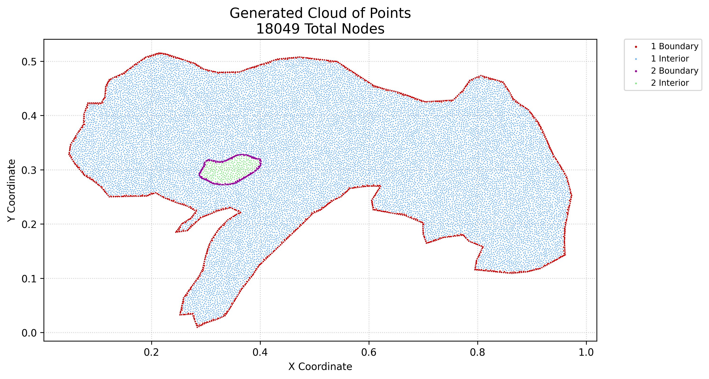
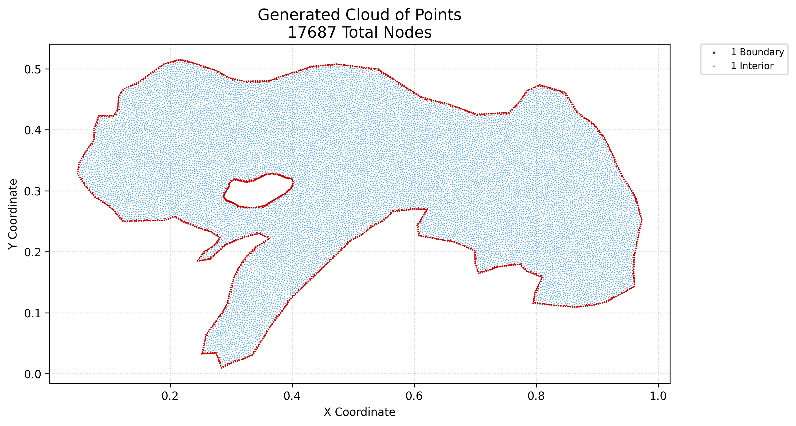
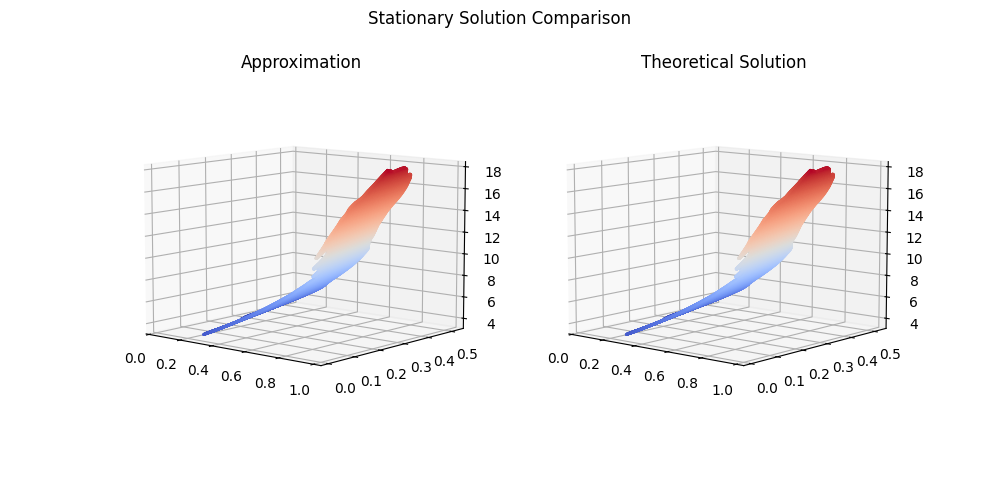
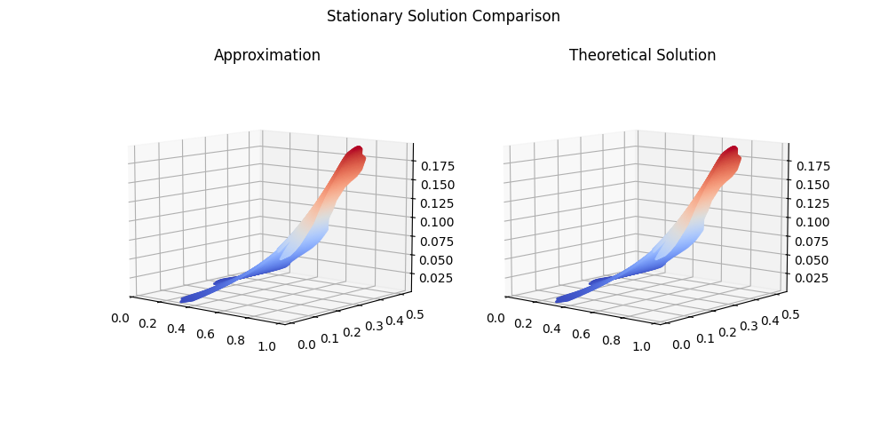
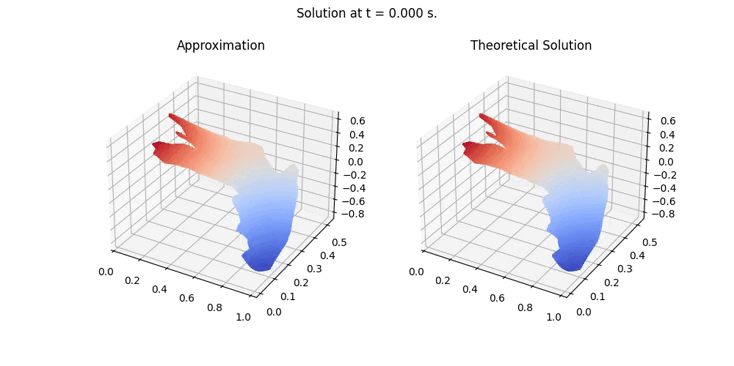
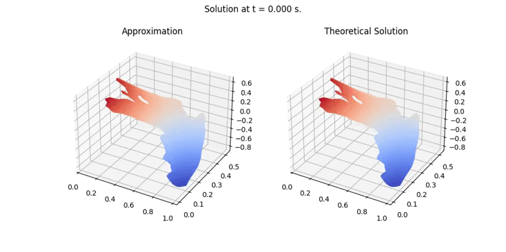
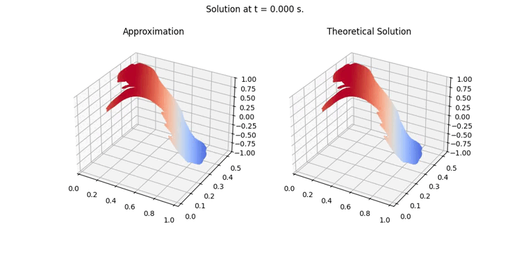
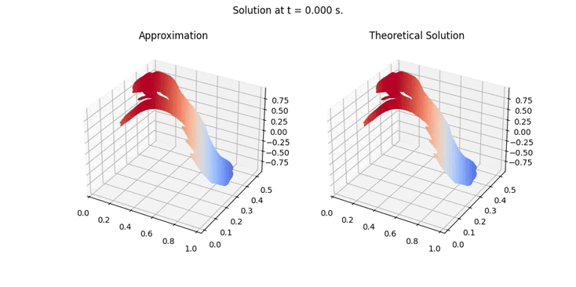
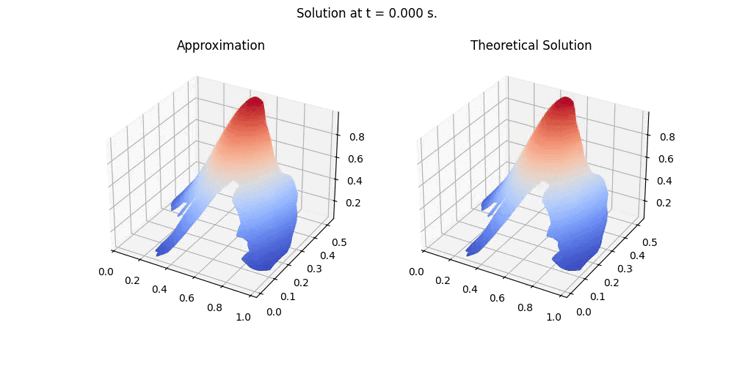

# mGFD: Meshless Generalized Finite Differences :triangular_ruler:

<div align="center">


[](https://github.com/gstinoco/mGFD) [](https://www.python.org/downloads/) [](https://numpy.org/) [](https://scipy.org/) [](https://matplotlib.org/) [](https://joblib.readthedocs.io/) [](https://opensource.org/licenses/MIT)

**Meshless framework and reference datasets for solving 2D PDEs on irregular domains using Generalized Finite Differences (mGFD)**

*From point clouds to neighbor stencils to PDE solutions — with error analysis and reproducible benchmarks*

### :link: Quick Links
[](#rocket-quick-start) [](#package-installation--setup) [](#books-mathematical-model) [](#file_cabinet-dataset-structure) [](#chart_with_upwards_trend-performance-benchmarks) [](#movie_camera-visualizations) [](#gear-api-documentation) [](#scientist-research-team) [](#handshake-contributing) [](#factory-industry-partners-supporting-innovation) [](#email-contact--support) [](#pray-acknowledgments)

</div>

---

## :clipboard: Table of Contents
- [Overview](#star2-overview)
- [Features](#sparkles-features)
- [Installation & Setup](#package-installation--setup)
- [Quick Start](#rocket-quick-start)
- [Usage Guide](#book-usage-guide)
- [Visualizations](#movie_camera-visualizations)
- [API Documentation](#gear-api-documentation)
- [Data Formats](#file_cabinet-data-formats)
- [Project Architecture](#open_file_folder-project-architecture)
- [Mathematical Model](#books-mathematical-model)
- [Dataset Structure](#file_cabinet-dataset-structure)
- [Performance Benchmarks](#chart_with_upwards_trend-performance-benchmarks)
- [Contributing](#handshake-contributing)
- [Research Team](#scientist-research-team)
- [Industry Partners Supporting Innovation](#factory-industry-partners-supporting-innovation)
- [Scientific References](#books-scientific-references)
- [Citation & License](#memo-citation--license)
- [Acknowledgments](#pray-acknowledgments)
- [Contact](#email-contact--support)
- [FAQ](#speech_balloon-faq)

---

## :star2: Overview

**mGFD (meshless Generalized Finite Differences)** provides a practical implementation of a meshless discretization workflow to solve **2D Partial Differential Equations (PDEs)** on **highly irregular domains**. The repository includes:
- a compact, reusable core in `mGFD.py`,
- batch scripts under `batches/` reproducing reference experiments,
- datasets under `Data/` (point-cloud domains, including variants with interior/exterior boundaries),
- and generated outputs under `Results/` (created when you run the batch scripts).

### :wrench: Key Capabilities
- **:triangular_ruler: Meshless discretization** without mesh generation.
- **:world_map: Irregular domains** (geographic and engineered regions).
- **:zap: Stationary PDEs** (e.g., Poisson-type operators).
- **:fire: Transient PDEs** (first-order and second-order time derivatives).
- **:floppy_disk: Reproducible datasets** and ready-to-run scripts.

### :microscope: Reference Equations Included

| Equation Type                   | Family               | Typical Use              |
|---------------------------------|----------------------|--------------------------|
| **Poisson** :zap:               | Stationary           | diffusion-like operators |
| **Heat** :fire:                 | First-order in time  | transient diffusion      |
| **Advection–Diffusion** :ocean: | First-order in time  | transport + diffusion    |
| **Wave** :sound:                | Second-order in time | propagation phenomena    |

---

## :sparkles: Features

### :triangular_ruler: Numerical Core
- **Operator-driven formulation** with coefficients for $u_{xx}, u_{xy}, u_{yy}, u_x, u_y, u$.
- **Neighbor selection** from point clouds or triangulations.
- **Gamma/stencil computation** via local geometric reconstructions.
- **Error evaluation** utilities for stationary and transient problems.

### :world_map: Domain & Data Handling
- **Point-cloud datasets** packaged under `Data/<Region>/<scale>/` with two main variants: `*_cloud.csv` (no holes) and `*_cloud_exterior.csv` (with holes).
- **Region catalog** with 2D domains used for consistent comparisons.
- **CSV-based interchange** for easy inspection and external tooling.

### :art: Visualization & Outputs
- **Static solution plots** (PNG/EPS) for stationary problems.
- **Transient animations** (GIF/MP4) for time-dependent problems.
- **Saved artifacts** under `Results/` for reproducibility.

---

## :package: Installation & Setup

### :computer: System Requirements

| Component  | Minimum | Recommended |
|------------|--------------------:|--------------------:|
| **Python** | 3.8+                | 3.10+               |
| **RAM**    | 4 GB                | 8 GB+               |
| **CPU**    | 2 cores             | 4+ cores            |
| **OS**     | Windows/Linux/macOS | Linux for long runs |

### :clipboard: Dependencies

Core runtime:

```python
numpy
scipy
matplotlib
joblib
```

Optional (used by benchmark / reporting scripts):

```python
pandas
psutil
```

### Quick Installation

```bash
git clone https://github.com/gstinoco/mGFD.git
cd mGFD

# Method 1: Virtual environment (recommended)
python -m venv mgfd_env
source mgfd_env/bin/activate  # On Windows: mgfd_env\Scripts\activate

pip install -U numpy scipy matplotlib joblib
pip install -U pandas psutil  # optional (benchmarks)
```

> Note: For reproducible runs across machines, pin your dependency versions in your environment (this repository does not ship a `requirements.txt`).

### :white_check_mark: Installation Verification

```bash
python -c "import numpy, scipy, matplotlib, joblib; print(':white_check_mark: Installation successful!')"
python batches/run_Poisson.py
```

---

## :rocket: Quick Start

<table>
  <thead>
    <tr>
      <th align="left" width="170">Step</th>
      <th align="left">What to do</th>
    </tr>
  </thead>
  <tbody>
    <tr>
      <td><b>1) Run a reference case</b></td>
      <td>
        <pre><code>python batches/run_Poisson.py</code></pre>
      </td>
    </tr>
    <tr>
      <td><b>2) Inspect outputs</b></td>
      <td>
        Check <code>Results/Poisson/&lt;Region&gt;/&lt;scale&gt;/&lt;variant&gt;/</code> (e.g., <code>Results/Poisson/Poopo/2x/cloud/</code>).
      </td>
    </tr>
    <tr>
      <td><b>3) Run everything</b></td>
      <td>
        <pre><code>python main.py</code></pre>
      </td>
    </tr>
  </tbody>
</table>

---

## :book: Usage Guide

<div align="center">

*Practical workflows for running the reference batches and using the core API in `mGFD.py`*

</div>

### :gear: Run the Batch Experiments

<table>
  <thead>
    <tr>
      <th align="left" width="220">Script</th>
      <th align="left">Purpose</th>
    </tr>
  </thead>
  <tbody>
    <tr>
      <td><b>batches/run_Poisson.py</b></td>
      <td>Stationary Poisson-type reference runs</td>
    </tr>
    <tr>
      <td><b>batches/run_Heat.py</b></td>
      <td>First-order transient diffusion (Heat equation)</td>
    </tr>
    <tr>
      <td><b>batches/run_AdvDif.py</b></td>
      <td>First-order transient transport + diffusion</td>
    </tr>
    <tr>
      <td><b>batches/run_Wave.py</b></td>
      <td>Second-order transient propagation (Wave equation)</td>
    </tr>
    <tr>
      <td><b>batches/run_Perturbation.py</b></td>
      <td>Stability/perturbation experiments (stationary)</td>
    </tr>
    <tr>
      <td><b>batches/run_Perturbation2.py</b></td>
      <td>Alternative stability/perturbation experiments (stationary)</td>
    </tr>
    <tr>
      <td><b>batches/benchmark.py</b></td>
      <td>Performance and memory benchmark suite</td>
    </tr>
  </tbody>
</table>

---

## :movie_camera: Visualizations

### :framed_picture: Poopo (Data/Poopo/)

<div align="center">

<table>
  <tr>
    <td align="center">
      <b>Cloud</b><br/>
      <sub>Data/Poopo/&lt;scale&gt;</sub><br/><br/>
      <br/>
    </td>
    <td align="center">
      <b>Cloud exterior (with holes)</b><br/>
      <sub>Data/Poopo/&lt;scale&gt; (cloud_exterior)</sub><br/><br/>
      <br/>
    </td>
  </tr>
</table>

</div>

### :zap: Stationary Examples (Poisson / Perturbation)

<div align="center">

<table>
  <tr>
    <td align="center">
      <b>Poisson (Cloud)</b><br/><br/>
      <br/>
      <a href="Results/Poisson/Poopo/2x/cloud/"><code>Results/Poisson/Poopo/2x/cloud/</code></a>
    </td>
    <td align="center">
      <b>Poisson (Cloud exterior)</b><br/><br/>
      <br/>
      <a href="Results/Poisson/Poopo/2x/cloud_exterior/"><code>Results/Poisson/Poopo/2x/cloud_exterior/</code></a>
    </td>
  </tr>
  <tr>
    <td align="center">
      <b>Perturbation (Cloud)</b><br/><br/>
      <br/>
      <a href="Results/Perturbation/Poopo/2x/cloud/"><code>Results/Perturbation/Poopo/2x/cloud/</code></a>
    </td>
    <td align="center">
      <b>Perturbation (Cloud exterior)</b><br/><br/>
      <br/>
      <a href="Results/Perturbation/Poopo/2x/cloud_exterior/"><code>Results/Perturbation/Poopo/2x/cloud_exterior/</code></a>
    </td>
  </tr>
</table>

</div>

### :movie_camera: Transient Animations (Heat / Wave / Advection–Diffusion)

<div align="center">

<table>
  <tr>
    <td align="center">
      <b>Heat (Cloud)</b><br/><br/>
      <br/>
      <a href="Results/Heat/Poopo/2x/cloud/"><code>Results/Heat/Poopo/2x/cloud/</code></a>
    </td>
    <td align="center">
      <b>Heat (Cloud exterior)</b><br/><br/>
      <br/>
      <a href="Results/Heat/Poopo/2x/cloud_exterior/"><code>Results/Heat/Poopo/2x/cloud_exterior/</code></a>
    </td>
  </tr>
  <tr>
    <td align="center">
      <b>Wave (Cloud)</b><br/><br/>
      <br/>
      <a href="Results/Wave/Poopo/2x/cloud/"><code>Results/Wave/Poopo/2x/cloud/</code></a>
    </td>
    <td align="center">
      <b>Wave (Cloud exterior)</b><br/><br/>
      <br/>
      <a href="Results/Wave/Poopo/2x/cloud_exterior/"><code>Results/Wave/Poopo/2x/cloud_exterior/</code></a>
    </td>
  </tr>
  <tr>
    <td align="center">
      <b>Advection–Diffusion (Cloud)</b><br/><br/>
      <br/>
      <a href="Results/AdvDif/Poopo/2x/cloud/"><code>Results/AdvDif/Poopo/2x/cloud/</code></a>
    </td>
    <td align="center">
      <b>Advection–Diffusion (Cloud exterior)</b><br/><br/>
      <br/>
      <a href="Results/AdvDif/Poopo/2x/cloud_exterior/"><code>Results/AdvDif/Poopo/2x/cloud_exterior/</code></a>
    </td>
  </tr>
</table>

</div>

> Tip: Outputs follow the layout `Results/<Equation>/<Region>/<scale>/<variant>/` for each equation family.

---

## :gear: API Documentation

The core routines are provided by `mGFD.py`:

| Routine           | PDE family                                     | Inputs (main)      | Outputs           |
|-------------------|------------------------------------------------|--------------------|-------------------|
| `Stationary`      | Poisson-type (stationary)                      | `p, phi, f`        | `u_ap, u_ex, vec` |
| `TimeDerivative1` | Heat / Advection–Diffusion (1st order in time) | `p, f, t, coef`    | `u_ap, u_ex, vec` |
| `TimeDerivative2` | Wave (2nd order in time)                       | `p, f, g, t, coef` | `u_ap, u_ex, vec` |

### :triangular_ruler: Minimal API Example (Stationary PDE)

```python
import numpy as np
from Scripts.IO import load_points
from mGFD import Stationary

p = load_points("Data/Poopo/2x/Poopo_cloud.csv")

phi = lambda x, y: 2*np.exp(2*x + y)
f = lambda x, y: 10*np.exp(2*x + y)

u_ap, u_ex, vec = Stationary(p, phi, f)
```

---

## :file_cabinet: Data Formats

### :triangular_flag_on_post: Point Cloud (`*_cloud.csv`)

Each row is a node with:
- `x,y`: normalized coordinates in $[0,1] \\times [0,1]$
- node class either as `flag` (integer) or `classification` (text), depending on the dataset file

Example:

```csv
x,y,region,classification
0.0113314447592068,0.32861189801699714,1,boundary
0.012128186968838528,0.3276381019830028,1,boundary
...
```

Notes:
- The solvers consume a `(m, 3)` array `p = [x, y, flag]`, where `flag=0` is interior and `flag=1/2` mark boundary-related nodes.
- Use `Scripts.IO.load_points(...)` to load dataset CSVs into this `(m, 3)` convention (it maps `classification` values like `boundary`/`hole` into `flag` when needed).
- Dataset variants:
  - `*_cloud.csv`: region without holes (either because the geometry has no islands, or because interior islands are filled by adding interior point clouds).
  - `*_cloud_exterior.csv`: region with holes (interior islands have no interior point clouds and are treated as voids).

---

## :open_file_folder: Project Architecture

```text
:package: mGFD/
├── mGFD.py                       # Core meshless solver routines
├── main.py                       # Runs the reference batches sequentially
├── LICENSE                       # MIT license
├── README.md                     # Project documentation
│
├── Data/                         # Point-cloud datasets (per region and scale)
├── Results/                      # Generated outputs (created by running scripts)
│
├── Scripts/                      # Support modules
│   ├── Errors.py                 # Error metrics
│   ├── Gammas.py                 # Gamma/stencil calculations
│   ├── Graph.py                  # Visualization helpers
│   ├── IO.py                     # Dataset + neighbor-cache I/O helpers
│   └── Neighbors.py              # Neighbor selection strategies
│
└── batches/                      # Reference experiments (reproducible)
    ├── run_Poisson.py
    ├── run_Heat.py
    ├── run_AdvDif.py
    ├── run_Wave.py
    ├── run_Perturbation.py
    ├── run_Perturbation2.py
    └── benchmark.py
```

---

## :books: Mathematical Model

mGFD solves operator-driven PDEs on an unstructured node set. A representative stationary problem is written as:

$$A u_{xx} + B u_{xy} + C u_{yy} + D u_x + E u_y + F u = -f(x,y)$$

Where boundary values are imposed through $u = \\phi(x,y)$ on boundary nodes and the interior unknowns are computed via local generalized finite difference stencils built from neighbor sets.

---

## :file_cabinet: Dataset Structure

All datasets are taken from the Author's [Cloud-Generation GitHub Repository](https://github.com/gstinoco/Cloud-Generation). The data is free to use for comparisons across methods using the same inputs.

### Variants (`cloud` vs `cloud_exterior`)

For each region/scale you may find two point-cloud variants:
- `*_cloud.csv`: region without holes (either because there are no islands, or because islands are filled by adding interior nodes so the domain stays connected).
- `*_cloud_exterior.csv`: region with holes (interior islands have no interior point cloud, so they are treated as void regions).

These point clouds supersede older dataset layouts used in previous versions of this repository.

### Available Regions (Folders under `Data/`)

<div align="center">

| Folder                | Example label used in figures |
|-----------------------|-------------------------------|
| `Alchichica`          | ALC                           |
| `Baikal`              | BAI                           |
| `Balkhash`            | BAL                           |
| `Caspio`              | CAS                           |
| `Catemaco`            | CAT                           |
| `Chapala`             | CHA                           |
| `Huron`               | HUR                           |
| `Patzcuaro`           | PAT                           |
| `Poopo`               | POO                           |
| `Santa Maria del Oro` | SMO                           |
| `Titicaca`            | TIT                           |
| `Yuriria`             | YUR                           |
| `Zirahuen`            | ZIR                           |

</div>

```text
Data/
├── <Region>/
│   ├── <Region>.png
│   ├── <Region>_contours.csv
│   ├── 2x/
│   │   ├── <Region>_cloud.csv
│   │   ├── <Region>_cloud.png
│   │   ├── <Region>_cloud.svg
│   │   ├── <Region>_cloud_exterior.csv          # optional
│   │   ├── <Region>_cloud_exterior.png          # optional
│   │   └── <Region>_cloud_exterior.svg          # optional
│   ├── 3x/
│   └── 4x/
└── ...
```

---

## :chart_with_upwards_trend: Performance Benchmarks

The benchmark suite measures runtime and memory usage for the reference problems (Poisson, Heat, Advection–Diffusion, Wave):

```bash
pip install -U pandas psutil
python batches/benchmark.py
```

The benchmark script writes its summary files under `benchmark_results/`.

---

## :handshake: Contributing

<div align="center">

### :star2: Contribute to the Project
*Bug reports, feature requests, and pull requests are welcome*

[](https://github.com/gstinoco/mGFD/issues)
[](https://github.com/gstinoco/mGFD/pulls)

</div>

### :bug: Bug Reports
1. **Search existing issues**: Check if the bug has already been reported
2. **Create a detailed report**: Include steps to reproduce and expected vs actual behavior
3. **Provide context**: Operating system, Python version, and the region/equation used

### :bulb: Feature Requests
1. **Describe the feature**: Clear and concise description of the proposed functionality
2. **Justify the need**: Explain how it benefits research, reproducibility, or usability
3. **Provide examples**: Use cases, expected inputs/outputs, and acceptance criteria

---

## :scientist: Research Team

<div align="center">

### :star2: Meet the Team
*Researchers and graduate students advancing meshless computational methods*

</div>

### :busts_in_silhouette: Main Researchers

<table align="center">
  <thead>
    <tr>
      <th align="center" width="120">Photo</th>
      <th align="left">Researcher</th>
      <th align="left">Affiliation</th>
      <th align="left">Contact</th>
    </tr>
  </thead>
  <tbody>
    <tr>
      <td align="center" width="120">
        
      </td>
      <td>
        <b>Dr. Gerardo Tinoco Guerrero</b> :mexico:<br/>
        <sub>Numerical Methods &amp; Computational Mathematics</sub>
      </td>
      <td>
        <a href="http://www.siiia.com.mx"></a><br/>
        <a href="http://www.umich.mx"></a>
      </td>
      <td>
        <a href="mailto:gerardo.tinoco@umich.mx"></a><br/>
        <a href="https://orcid.org/0000-0003-3119-770X"></a><br/>
        <a href="https://www.researchgate.net/profile/Gerardo-Tinoco-Guerrero"></a>
      </td>
    </tr>
    <tr>
      <td align="center" width="120">
        
      </td>
      <td>
        <b>Dr. Francisco Javier Domínguez Mota</b> :mexico:<br/>
        <sub>Applied Mathematics &amp; Finite Difference Methods</sub>
      </td>
      <td>
        <a href="http://www.siiia.com.mx"></a><br/>
        <a href="http://www.umich.mx"></a>
      </td>
      <td>
        <a href="mailto:francisco.mota@umich.mx"></a><br/>
        <a href="https://orcid.org/0000-0001-6837-172X"></a><br/>
        <a href="https://www.researchgate.net/profile/Francisco-Dominguez-Mota"></a>
      </td>
    </tr>
    <tr>
      <td align="center" width="120">
        
      </td>
      <td>
        <b>Dr. José Alberto Guzmán Torres</b> :mexico:<br/>
        <sub>Engineering Applications &amp; Artificial Intelligence</sub>
      </td>
      <td>
        <a href="http://www.siiia.com.mx"></a><br/>
        <a href="http://www.umich.mx"></a>
      </td>
      <td>
        <a href="mailto:jose.alberto.guzman@umich.mx"></a><br/>
        <a href="https://orcid.org/0000-0002-9309-9390"></a><br/>
        <a href="https://www.researchgate.net/profile/Jose-Guzman-Torres"></a>
      </td>
    </tr>
    <tr>
      <td align="center" width="120">
        
      </td>
      <td>
        <b>Dr. Heriberto Árias Rojas</b> :mexico:<br/>
        <sub>Engineering Applications</sub>
      </td>
      <td>
        <a href="http://www.siiia.com.mx"></a><br/>
        <a href="http://www.umich.mx"></a>
      </td>
      <td>
        <a href="mailto:heriberto.arias@umich.mx"></a><br/>
        <a href="https://orcid.org/0000-0002-7641-8310"></a><br/>
        <a href="https://www.researchgate.net/profile/Heriberto-Arias-Rojas"></a>
      </td>
    </tr>
  </tbody>
</table>

### :mortar_board: Ph.D. Research Students

<table align="center">
  <thead>
    <tr>
      <th align="center" width="120">Photo</th>
      <th align="left">Student</th>
      <th align="left">Institution</th>
      <th align="left">Contact</th>
    </tr>
  </thead>
  <tbody>
    <tr>
      <td align="center" width="120">
        
      </td>
      <td>
        <b>Gabriela Pedraza-Jiménez</b><br/>
        
      </td>
      <td>
        <a href="http://www.umich.mx"></a>
      </td>
      <td>
        <a href="mailto:2220157h@umich.mx"></a>
      </td>
    </tr>
    <tr>
      <td align="center" width="120">
        
      </td>
      <td>
        <b>Eli Chagolla-Inzunza</b><br/>
        
      </td>
      <td>
        <a href="http://www.umich.mx"></a>
      </td>
      <td>
        <a href="mailto:1137626b@umich.mx"></a>
      </td>
    </tr>
  </tbody>
</table>

### :mortar_board: M.Sc. Research Students

<table align="center">
  <thead>
    <tr>
      <th align="center" width="120">Photo</th>
      <th align="left">Student</th>
      <th align="left">Institution</th>
      <th align="left">Contact</th>
    </tr>
  </thead>
  <tbody>
    <tr>
      <td align="center" width="120">
        
      </td>
      <td>
        <b>Jorge L. González-Figueroa</b><br/>
        
      </td>
      <td>
        <a href="http://www.umich.mx"></a>
      </td>
      <td>
        <a href="mailto:1718717h@umich.mx"></a>
      </td>
    </tr>
    <tr>
      <td align="center" width="120">
        
      </td>
      <td>
        <b>Christopher N. Magaña-Barocio</b><br/>
        
      </td>
      <td>
        <a href="http://www.umich.mx"></a>
      </td>
      <td>
        <a href="mailto:1339846k@umich.mx"></a>
      </td>
    </tr>
  </tbody>
</table>

### :mortar_board: Undergraduate Research Students

<table align="center">
  <thead>
    <tr>
      <th align="center" width="120">Photo</th>
      <th align="left">Student</th>
      <th align="left">Institution</th>
      <th align="left">Contact</th>
    </tr>
  </thead>
  <tbody>
    <tr>
      <td align="center" width="120">
        
      </td>
      <td>
        <b>Maria Goretti Fraga-Lopez</b><br/>
        
      </td>
      <td>
        <a href="http://www.umich.mx"></a>
      </td>
      <td>
        <a href="mailto:1702174b@umich.mx"></a>
      </td>
    </tr>
  </tbody>
</table>

---

## :factory: Industry Partners Supporting Innovation

<div align="center">

### :star2: Industry Partners Supporting Innovation
*Collaboration between academia and industry to accelerate real-world impact*

</div>

<div align="center">

<table align="center" width="70%">
<tr>
<td align="center">

### :factory: **SIIIA MATH**
#### *Soluciones de Ingeniería, México*

<div align="center">

[](http://www.siiia.com.mx)
[](http://www.siiia.com.mx)
[](http://www.siiia.com.mx)

</div>

**🎯 Focus areas:**
- Mathematical modeling & simulation
- AI/ML engineering solutions
- Technology transfer and applied R&amp;D

<div align="center">

[](mailto:gtinoco@siiia.com.mx)

</div>

</td>
</tr>
</table>

</div>

---

## :books: Scientific References

### :books: Core Publications (GFD / mGFD Background)

1. **Tinoco-Guerrero, G.**, Domínguez-Mota, F. J., Guzmán-Torres, J. A., & Tinoco-Ruiz, J. G. (2022). *"Numerical Solution of Diffusion Equation using a Method of Lines and Generalized Finite Differences."* **Revista Internacional de Métodos Numéricos para Cálculo y Diseño en Ingeniería**, 38(2). [DOI: 10.23967/j.rimni.2022.06.003](http://dx.doi.org/10.23967/j.rimni.2022.06.003)

### :trophy: Project Highlights

- **Meshless PDE solver core** for irregular 2D domains using Generalized Finite Differences (mGFD)
- **Reference datasets** (multiple regions, scales, and variants) enabling consistent method-to-method comparisons
- **Reproducible batch scripts** covering Poisson, Heat, Advection–Diffusion, and Wave equation families
- **Error analysis and benchmarks** with saved artifacts under `Results/` for validation and reporting

---

## :memo: Citation & License

If you use this repository in your research, please cite:

```bibtex
@software{tinoco2024mGFD,
  title={mGFD: Meshless Generalized Finite Differences for Partial Differential Equations},
  author={Tinoco-Guerrero, Gerardo and
          Domínguez-Mota, Francisco Javier and
          Guzmán-Torres, José Alberto and
          Arias-Rojas, Heriberto},
  year={2024},
  institution={Universidad Michoacana de San Nicolás de Hidalgo},
  organization={SIIIA MATH: Soluciones en ingeniería},
  url={https://github.com/gstinoco/mGFD},
  note={Meshless solver and reference datasets for irregular domains using generalized finite differences}
}
```

### :page_facing_up: License

This project is licensed under the **MIT License** (see [LICENSE](LICENSE)).

```
MIT License

Copyright (c) 2024 Gerardo Tinoco-Guerrero

Permission is hereby granted, free of charge, to any person obtaining a copy
of this software and associated documentation files (the "Software"), to deal
in the Software without restriction, including without limitation the rights
to use, copy, modify, merge, publish, distribute, sublicense, and/or sell
copies of the Software, and to permit persons to whom the Software is
furnished to do so, subject to the following conditions:

The above copyright notice and this permission notice shall be included in all
copies or substantial portions of the Software.

THE SOFTWARE IS PROVIDED "AS IS", WITHOUT WARRANTY OF ANY KIND, EXPRESS OR
IMPLIED, INCLUDING BUT NOT LIMITED TO THE WARRANTIES OF MERCHANTABILITY,
FITNESS FOR A PARTICULAR PURPOSE AND NONINFRINGEMENT. IN NO EVENT SHALL THE
AUTHORS OR COPYRIGHT HOLDERS BE LIABLE FOR ANY CLAIM, DAMAGES OR OTHER
LIABILITY, WHETHER IN AN ACTION OF CONTRACT, TORT OR OTHERWISE, ARISING FROM,
OUT OF OR IN CONNECTION WITH THE SOFTWARE OR THE USE OR OTHER DEALINGS IN THE
SOFTWARE.
```

---

## :pray: Acknowledgments

<div align="center">

### :heart: Special Thanks
*We extend our gratitude to the institutions and partners supporting this research and open-source development*

</div>

### :classical_building: Institutional Support

<table align="center" width="100%" cellspacing="14">
  <tr>
    <td width="50%" valign="top">
      <div style="border: 1px solid #d0d7de; border-radius: 12px; padding: 16px;">
        <div align="center">
          <b>🎓 Universidad Michoacana de San Nicolás de Hidalgo (UMSNH)</b><br/>
          <sub>Academic institution, Mexico</sub><br/><br/>
          <a href="http://www.umich.mx"></a>
          
          
        </div>
        <br/>
        <b>Key support</b>
        <ul>
          <li>Academic foundation and research infrastructure</li>
          <li>Scientific training and supervision environment</li>
        </ul>
      </div>
    </td>
    <td width="50%" valign="top">
      <div style="border: 1px solid #d0d7de; border-radius: 12px; padding: 16px;">
        <div align="center">
          <b>🏛️ Secretariat of Science, Humanities, Technology and Innovation (SECIHTI)</b><br/>
          <sub>State Secretariat, Mexico</sub><br/><br/>
          <a href="https://secihti.mx/"></a>
          
          
        </div>
        <br/>
        <b>Key support</b>
        <ul>
          <li>Support for science and technology initiatives</li>
          <li>Funding and innovation promotion</li>
        </ul>
      </div>
    </td>
  </tr>
  <tr>
    <td width="50%" valign="top">
      <div style="border: 1px solid #d0d7de; border-radius: 12px; padding: 16px;">
        <div align="center">
          <b>🌿 Centre Internacional de Mètodes Numèrics en Enginyeria (CIMNE)</b><br/>
          <sub>Industry, Spain</sub><br/><br/>
          <a href="https://aulas.cimne.com/aula/aula-morelia/"></a>
          
          
        </div>
        <br/>
        <b>Key support</b>
        <ul>
          <li>International collaboration in numerical methods</li>
          <li>Computational engineering research environment</li>
        </ul>
      </div>
    </td>
    <td width="50%" valign="top">
      <div style="border: 1px solid #d0d7de; border-radius: 12px; padding: 16px;">
        <div align="center">
          <b>🏭 SIIIA MATH: Soluciones en Ingeniería</b><br/>
          <sub>Industry, México</sub><br/><br/>
          <a href="http://www.siiia.com.mx"></a>
          
          
        </div>
        <br/>
        <b>Key support</b>
        <ul>
          <li>Industry-driven applied research and development</li>
          <li>Technology transfer and practical engineering impact</li>
        </ul>
      </div>
    </td>
  </tr>
</table>

### :building_with_garden: Research Centers & Collaborations

<div align="center">

<table align="center" width="100%" cellspacing="14">
  <tr>
    <td width="50%" valign="top">
      <div style="border: 1px solid #d0d7de; border-radius: 12px; padding: 16px;">
        <div align="center">
          <b>🌿 Aula CIMNE-Morelia</b><br/>
          <sub>Research collaboration space</sub><br/><br/>
          <a href="https://aulas.cimne.com/aula/aula-morelia/"></a>
          
          
        </div>
        <br/>
        <b>Collaboration highlights</b>
        <ul>
          <li>Numerical methods and computational engineering environment</li>
          <li>Academic–industry collaboration and training activities</li>
        </ul>
      </div>
    </td>
    <td width="50%" valign="top">
      <div style="border: 1px solid #d0d7de; border-radius: 12px; padding: 16px;">
        <div align="center">
          <b>🎓 UMSNH</b><br/>
          <sub>Academic collaboration</sub><br/><br/>
          <a href="http://www.umich.mx"></a>
          
          
        </div>
        <br/>
        <b>Collaboration highlights</b>
        <ul>
          <li>Institutional infrastructure supporting research and training</li>
          <li>Graduate formation and supervision for scientific computing</li>
        </ul>
      </div>
    </td>
  </tr>
</table>

</div>

### :computer: Technology Communities

<div align="center">

| :package: Framework | :busts_in_silhouette: Community | :star: Contribution |
|:---:|:---:|:---:|
| [](https://numpy.org/) | **NumPy Community** | Array computing foundation |
| [](https://scipy.org/) | **SciPy Community** | Numerical algorithms |
| [](https://matplotlib.org/) | **Matplotlib Community** | Scientific visualization |
| [](https://joblib.readthedocs.io/) | **Joblib Community** | Parallel computing utilities |

</div>

---

## :email: Contact & Support

<div align="center">

*Contact channels, technical support, and collaboration opportunities*

[](https://github.com/gstinoco/mGFD/issues)
[](mailto:gerardo.tinoco@umich.mx)

</div>

<table align="center" width="100%" cellspacing="14">
  <tr>
    <td valign="top" style="border: 1px solid #d0d7de; border-radius: 12px; padding: 16px;">
      <div align="center">
        <b>Primary Contact</b><br/>
        <sub>Research group coordination</sub>
      </div>
      <br/>
      <b>Dr. Gerardo Tinoco Guerrero</b><br/>
      <sub>Morelia, Michoacán, México</sub>
      <br/><br/>
      <div align="center">
        <a href="mailto:gerardo.tinoco@umich.mx"></a>
        <a href="http://www.siiia.com.mx"></a>
        <a href="http://www.umich.mx"></a>
      </div>
    </td>
  </tr>
  <tr>
    <td valign="top" style="border: 1px solid #d0d7de; border-radius: 12px; padding: 16px;">
      <div align="center">
        <b>Technical Support</b><br/>
        <sub>Bug reports and questions</sub>
      </div>
      <br/>
      <div align="center">
        <a href="https://github.com/gstinoco/mGFD/issues"></a>
        <a href="mailto:gerardo.tinoco@umich.mx"></a>
      </div>
    </td>
  </tr>
</table>

---

## :speech_balloon: FAQ

<details>
  <summary><b>Where are datasets located?</b></summary>
  <br/>
  Under <code>Data/&lt;Region&gt;/&lt;scale&gt;/</code>, e.g. <code>Data/Poopo/2x/Poopo_cloud.csv</code>.
</details>

<details>
  <summary><b>What is the difference between <code>cloud</code> and <code>cloud_exterior</code>?</b></summary>
  <br/>
  They are two input variants of the same region at the same scale:
  <ul>
    <li><code>*_cloud.csv</code>: no holes (islands are filled with interior nodes, or the geometry has no islands).</li>
    <li><code>*_cloud_exterior.csv</code>: with holes (islands have no interior nodes and are treated as void regions).</li>
  </ul>
  Both are loaded into the solver as <code>p=[x,y,flag]</code> via <code>Scripts.IO.load_points</code>.
</details>

<details>
  <summary><b>How do I reproduce the reference outputs?</b></summary>
  <br/>
  Run the scripts under <code>batches/</code> (or <code>python main.py</code>) and inspect <code>Results/&lt;Equation&gt;/&lt;Region&gt;/&lt;scale&gt;/&lt;variant&gt;/</code>. Benchmarks are stored under <code>benchmark_results/</code>.
</details>

---

<div align="center">

*Advancing meshless methods through open-source collaboration*

[](https://github.com/gstinoco/mGFD/stargazers) [](https://github.com/gstinoco/mGFD/network/members) [](https://github.com/gstinoco/mGFD/watchers)

<br/>

<b>If this project helps your research, please consider giving it a star.</b>

</div>
