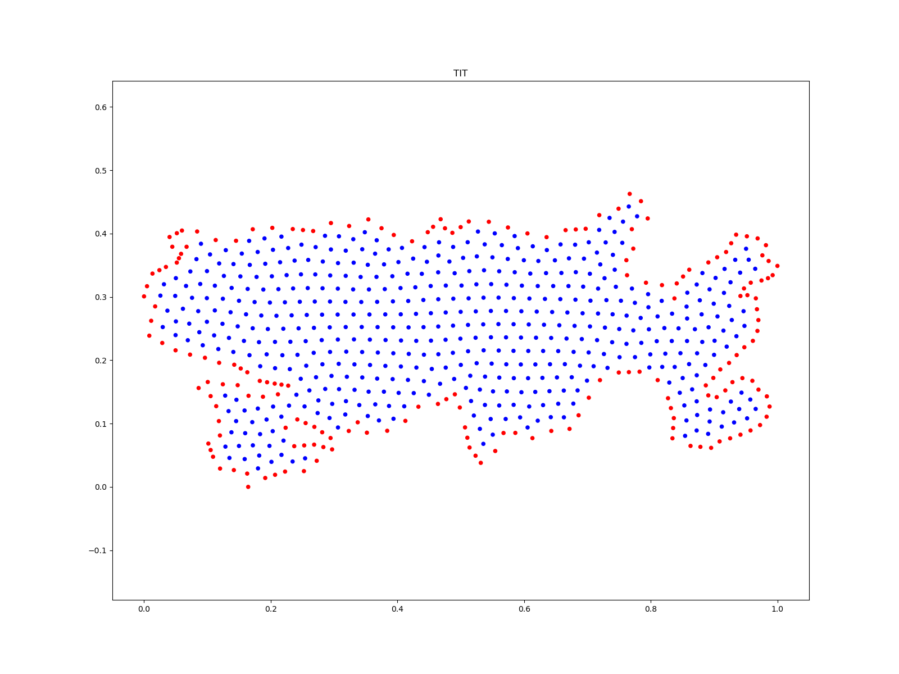
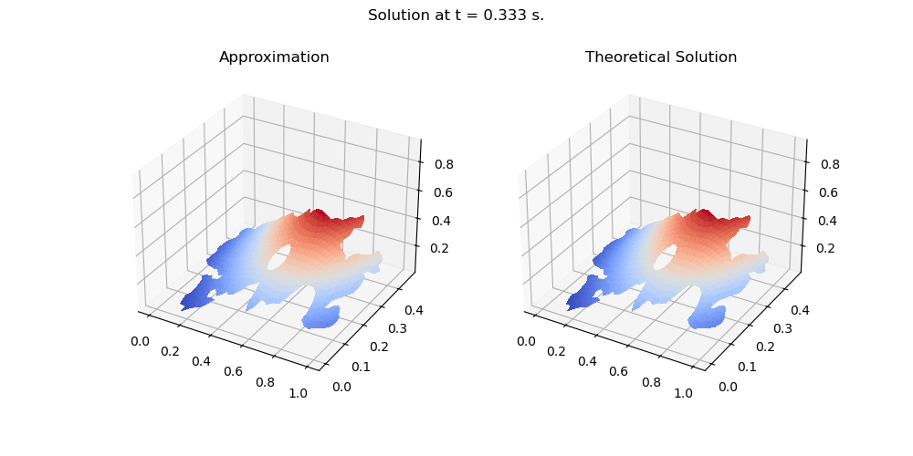
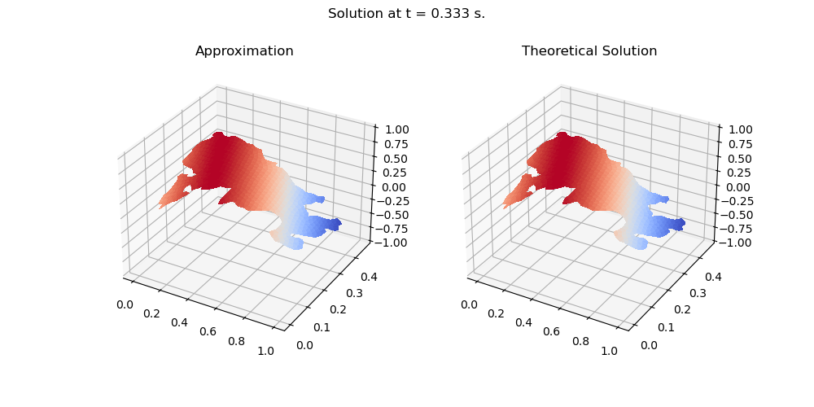

# mGFD
Data and methods for numerically solving Partial Differential Equations using a meshless Generalized Finite Differences Scheme.

All the codes are distributed under MIT License on [GitHub](https://github.com/gstinoco/mGFD) and are free to use, modify, and distribute giving the proper copyright notice.

## Description :memo:
This repository proposes a way to achieve approximations to various Partial Differential Equations in two dimensions over regions that can range from regular (CUA) to highly irregular (ENG).

For this, the proposed method uses a Generalized Finite Differences Method for the numerical solution on unstructured clouds of points.

<table border="0">
    <tr>
        <th style="text-align: center;">Titicaca Lake Cloud of Points</th>
        <th style="text-align: center;">Titicaca Lake Cloud of Points with Holes</th>
    </tr>
    <tr>
        <th></th>            <th></th>
    </tr>
    <tr>
        <td colspan="2" style="text-align: center;">Poisson Equation</td>
    <tr>
    <tr>
        <td></td>
        <td></td>
    </tr>
    <tr>
        <td colspan="2" style="text-align: center;">Heat Equation</td>
    <tr>
    <tr>
        <td><video src="https://youtu.be/f6Invdy5juY"></video></td>
        <td><video src="https://github.com/gstinoco/mGFD/blob/main/Results/Holes/Heat/TIT/Solution.mp4"></video></td>
    </tr>
    <tr>
        <td colspan="2" style="text-align: center;">Advection-Diffusion Equation</td>
    <tr>
    <tr>
        <td></td>
        <td></td>
    </tr>
    <tr>
        <td colspan="2" style="text-align: center;">Wave Equation</td>
    <tr>
    <tr>
        <td></td>
        <td></td>
    </tr>
</table>

It is possible to find several test data in the "Data" folder and some results in the "Results" folder.

## Researchers :scientist:
All the codes presented were developed by:
    
  - Dr. Gerardo Tinoco Guerrero 
    Universidad Michoacana de San Nicolás de Hidalgo 
    Aula CIMNE-Morelia 
    gerardo.tinoco@umich.mx 
    https://orcid.org/0000-0003-3119-770X

  - Dr. Francisco Javier Domínguez Mota 
    Universidad Michoacana de San Nicolás de Hidalgo 
    Aula CIMNE-Morelia 
    francisco.mota@umich.mx 
    https://orcid.org/0000-0001-6837-172X
  
  - Dr. José Gerardo Tinoco Ruiz 
    Universidad Michoacana de San Nicolás de Hidalgo 
    jose.gerardo.tinoco@umich.mx 
    https://orcid.org/0000-0002-0866-4798

  - Dr. José Alberto Guzmán Torres 
    Universidad Michoacana de San Nicolás de Hidalgo 
    Aula CIMNE-Morelia 
    jose.alberto.guzman@umich.mx 
    https://orcid.org/0000-0002-9309-9390

## Students :man_student: :woman_student:
  - Heriberto Arias Rojas 
    Universidad Michoacana de San Nicolás de Hidalgo 
    heriberto.arias@umich.mx 
    https://orcid.org/0000-0002-7641-8310

  - Gabriela Pedraza Jiménez 
    Universidad Michoacana de San Nicolás de Hidalgo 
    2220157h@umich.mx 
    https://orcid.org/0009-0002-8118-0260
  
  - Miguel Ángel Rodríguez Velázquez 
    Universidad Michoacana de San Nicolás de Hidalgo 
    miguel.rodriguez@umich.mx 
    https://orcid.org/0009-0009-7245-1517
  
  - Ricardo Román Gutiérrez 
    Universidad Michoacana de San Nicolás de Hidalgo 
    ricardo.roman@umich.mx 
    https://orcid.org/0000-0001-8521-9391

## Funding :dollar:
With the financing of:

  - National Council of Humanities, Sciences and Technologies, CONAHCyT (Consejo Nacional de Humanidades, Ciencias y Tecnologías, CONAHCyT), México.
  
  - Coordination of Scientific Research, CIC-UMSNH (Coordinación de la Investigación Científica de la Universidad Michoacana de San Nicolás de Hidalgo, CIC-UMSNH), México.
  
  - Aula CIMNE-Morelia, México.