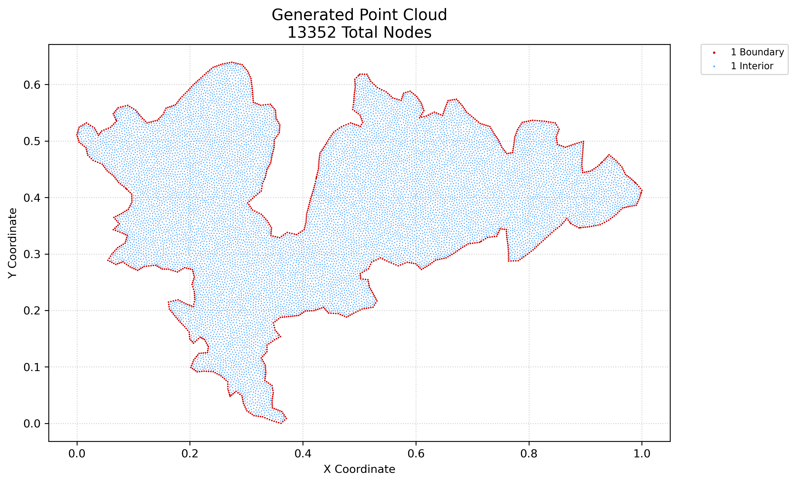

<div align="center">

# 🗂️ Benchmark Datasets

*Highly irregular, real-world geometric point clouds for numerical validation*

</div>

The `mGFD` research laboratory includes a comprehensive suite of geographic datasets. These domains represent highly irregular, real-world geometries that challenge traditional mesh-based methods. All point clouds were generated using the companion Poisson-Disk algorithm from the `mGFD CloudGenerator`.

---

## 1. 🌍 Geographic Regions

The laboratory provides point clouds for **20 distinct geographic regions** (primarily lakes from around the world). These regions test the method's ability to handle complex boundary curvatures, narrow bottlenecks, and multi-scale features.

| Region Name | Abbreviation | Location | Geometric Description |
|:---|:---:|:---|:---|
| **Alchichica** | `ALC` | 🇲🇽 Mexico | Maar crater lake testing pure radial symmetry and smooth curves. |
| **Baikal** | `BAI` | 🇷🇺 Russia | Deepest freshwater lake; tests elongated, high-aspect-ratio tectonic geometry. |
| **Balkhash** | `BAL` | 🇰🇿 Kazakhstan | Narrow, crescent-shaped lake testing flow through complex straits. |
| **Caspian** | `CAS` | 🌍 Eurasia | Largest enclosed inland body; vast multi-scale domain with smooth and jagged coasts. |
| **Catemaco** | `CAT` | 🇲🇽 Mexico | Volcanic lake featuring interior islands (challenging internal boundary holes). |
| **Chapala** | `CHA` | 🇲🇽 Mexico | Extensive lake with smooth, elongated boundaries. |
| **Cuitzeo** | `CUI` | 🇲🇽 Mexico | Highly irregular lake prone to severe fragmentation and narrow land bridges. |
| **Erie** | `ERI` | 🌎 North America | Great Lake with asymmetric borders and large-scale curvature. |
| **Huron** | `HUR` | 🌎 North America | Features massive bays and complex island clusters (e.g., Manitoulin). |
| **Ladoga** | `LAD` | 🇷🇺 Russia | Large lake with a highly fragmented, island-rich northern coast. |
| **Malawi** | `MAL` | 🌍 Africa | Long, narrow tectonic trench testing extreme length-to-width aspect ratios. |
| **Metztitlán** | `MET` | 🇲🇽 Mexico | Variable boundaries; the primary visual benchmark for unstructured clouds. |
| **Ness** | `NES` | 🏴󠁧󠁢󠁳󠁣󠁴󠁿 Scotland | Extremely narrow, straight glacial loch testing highly confined flow. |
| **Patzcuaro** | `PAT` | 🇲🇽 Mexico | C-shaped volcanic lake with prominent central islands. |
| **Poopo** | `POO` | 🇧🇴 Bolivia | Shallow saline lake with highly variable, vanishing borders. |
| **Santa Maria del Oro**| `SMO` | 🇲🇽 Mexico | Small, nearly perfectly circular crater lake. |
| **Titicaca** | `TIT` | 🌎 South America | Complex domain featuring deeply divided sub-basins connected by a strait. |
| **Yuriria** | `YUR` | 🇲🇽 Mexico | Artificial volcanic crater lake with a distinctive irregular perimeter. |
| **Zempoala** | `ZEM` | 🇲🇽 Mexico | Small, interconnected alpine lakes with intricate boundary merging. |
| **Zirahuen** | `ZIR` | 🇲🇽 Mexico | Deep mountain lake with a compact, teardrop-like shape. |

---

## 2. 📏 Density Scales

To evaluate the numerical convergence and execution performance of the `mGFD` method, each geographic region is discretized at **5 different node densities**. 

Inside `research/data/<Region>/`, you will find subdirectories numbered `1` through `5`:

> [!NOTE]
> **Scale Range:**
> *   `1/`: The **coarsest** point cloud representation (ideal for fast prototyping and debugging).
> *   `5/`: The **most dense** point cloud representation (used for high-fidelity physics and convergence validation).
>
> *Note on Graphical Outputs:* To optimize repository storage and processing times during massive automated sweeps, MP4 animations and PNG renderings are intentionally restricted exclusively to **Scale 3** using the `nvec_16_spsolve` baseline configuration.

Numerical benchmarks iterate over these 5 scales to plot error convergence bounds ($\mathcal{O}(h^2)$) as the spatial step size $h$ approaches zero.

---

## 3. 🧩 Cloud Components

Within every scale directory (e.g., `research/data/Metztitlán/3/`), you will find the following core files essential for the simulations. Below is a visual example of the point cloud structure:

<div align="center">
  
  <br/>
  <sub><em>Visualization of the unstructured point cloud for Lake Metztitlán (Mexico)</em></sub>
</div>
<br/>

### 📍 The Unstructured Cloud (`*_cloud.csv`)
This is the primary spatial domain. It contains the $m \times 3$ coordinate matrix where columns represent: `[x, y, flag]`. 
*   `flag = 0`: Interior computational nodes
*   `flag = 1`: Primary outer boundary nodes
*   `flag = 2`: Inner boundary nodes (e.g., islands or internal holes)

### 🕸️ Precomputed Stencils (`*_neighbors_12.csv`)
To accelerate the solver execution during massive batch testing, the local neighborhoods are precomputed using a fast **KD-Tree** algorithm. This file stores an $m \times 12$ integer matrix, where each row contains the indices of the up to 12 closest neighbors for the corresponding node in the cloud.

### 🌬️ Upwind Stencils (`*_adv_vx1_vy0_neighbors_12.csv`)
For advection-dominated problems (like the Advection-Diffusion equation), symmetric stencils induce instability. This file contains the precomputed neighbors constrained strictly to the *upstream* direction relative to a flow velocity vector of $(v_x=1, v_y=0)$. 

> [!WARNING]
> ### 🔺 Visualization Mesh (`*_triangulation.csv`)
> `mGFD` is strictly a **meshless** method. The mathematical solvers *never* use elements, cells, or connectivity matrices. However, plotting tools (like PyVista for `.vtk` exports) require polygons to render continuous color maps. This file contains an automatically cached Delaunay triangulation used **exclusively for data visualization** to save overhead during continuous rendering.

---

## 4. 💻 Loading the Datasets (Python)

If you are building your own solvers from scratch using this laboratory, there is a critical technical detail regarding the **Precomputed Stencils** you must handle: **Padding**.

If a boundary node has fewer viable neighbors than the requested matrix size (e.g., 8 neighbors found for a 12-neighbor stencil), the unused trailing slots in the CSV row are padded with `-1`. **You must filter out these `-1` indices before extracting coordinates**, otherwise your arrays will throw an Out-of-Bounds error.

Here is a robust snippet to properly load a point cloud and safely iterate over its KD-Tree stencils:

```python
import numpy as np
import pandas as pd

# 1. Load the unstructured point cloud
cloud_df = pd.read_csv("Metztitlan_3_cloud.csv", header=None)
p = cloud_df.values  # Shape: (m, 3) -> [x, y, flag]

# Separate coordinates and flags
coords = p[:, 0:2]
flags = p[:, 2]

# 2. Load the precomputed KD-Tree stencils
vec_df = pd.read_csv("Metztitlan_3_neighbors_12.csv", header=None)
vec = vec_df.values  # Shape: (m, 12)

# 3. Safe iteration example
central_node_idx = 150
print(f"Coordinates of Central Node: {coords[central_node_idx]}")

# Extract neighbors and filter out the '-1' padding
raw_neighbors = vec[central_node_idx]
valid_neighbors = raw_neighbors[raw_neighbors != -1]

print(f"Valid neighbor indices: {valid_neighbors}")
print(f"Neighbor coordinates:\n{coords[valid_neighbors]}")
```
