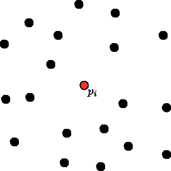
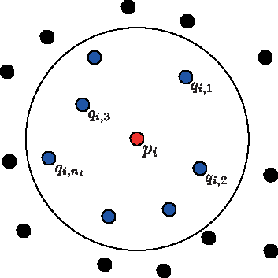
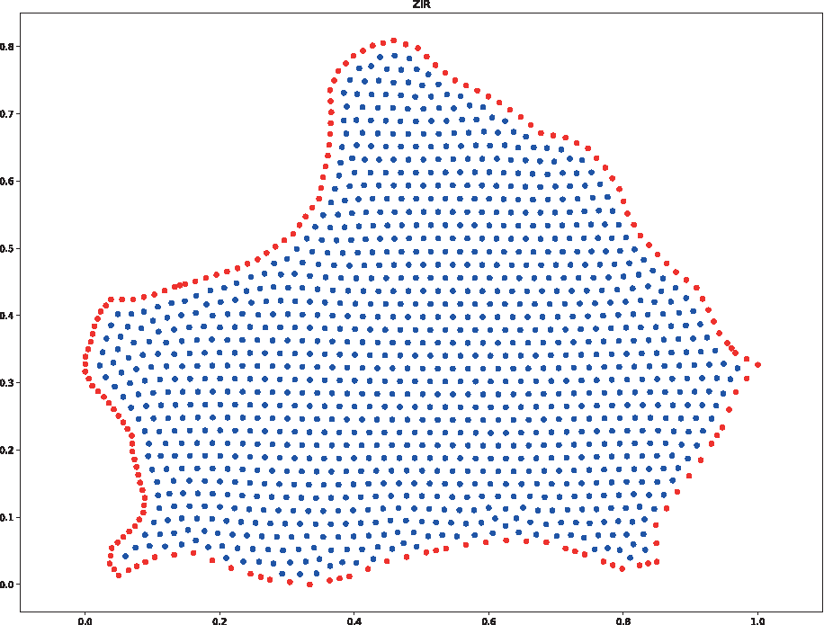
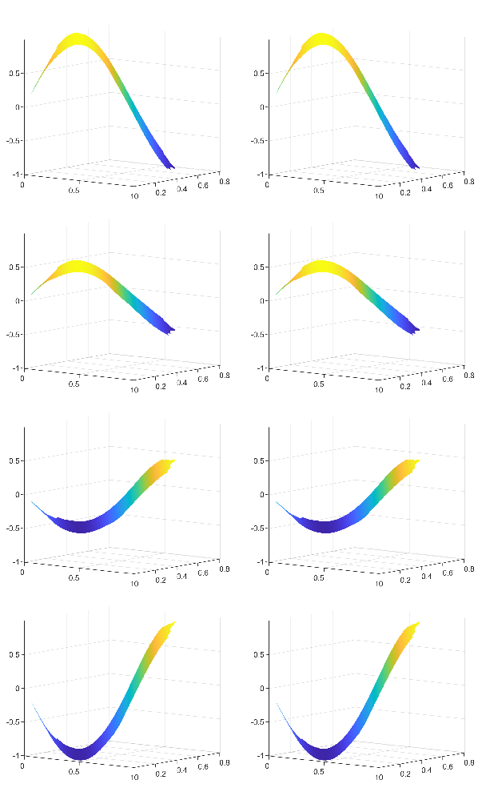

<div align="center">

# 🧮 Mathematical Methodology: mGFD

*Rigorous mathematical derivation of the meshless Generalized Finite Difference method*

</div>

The meshless Generalized Finite Difference (mGFD) method is a flexible, highly stable numerical scheme for solving Partial Differential Equations (PDEs) directly on unstructured point clouds, bypassing the complex mesh-generation phase required by traditional FEM or FVM.

<br/>

> [!NOTE]
> **Core Novelty (2025):** Unlike classical Generalized Finite Difference Methods that require empirical spatial weighting functions (e.g., $w = 1/r^3$ or Gaussian functions) to ensure solvability, the mGFD method enforces consistency through a direct optimization formulation using the Moore-Penrose pseudoinverse. This elegantly minimizes the Euclidean norm of the weights, eliminating the need for arbitrary weight functions and user-defined tuning parameters.

---

## 1. 📐 The General Partial Differential Operator

A general second-order linear partial differential operator $L$ over a scalar field $u(x, y)$ can be expressed as:

<div align="center">

$$ L u = A u_{xx} + B u_{xy} + C u_{yy} + D u_x + E u_y + F u $$

</div>

### 🧩 Operator Components

| Coefficient | Corresponding Term | Physical Interpretation (Example) |
| :---: | :--- | :--- |
| **$A, B, C$** | $u_{xx}, u_{xy}, u_{yy}$ | Diffusion / Dispersive components |
| **$D, E$** | $u_x, u_y$ | Advection / Convective velocity field |
| **$F$** | $u$ | Reaction / Source / Sink term |

In the mGFD scheme, we consider a non-uniform distribution of nodes $P = (x, y)$ as shown below.

<div align="center">
  
  <br/>
  <sub><em>Fig 1. Arbitrary distribution of nodes.</em></sub>
</div>
<br/>

For an arbitrary central node $p_i = (x_i, y_i)$, the continuous operator $L u$ is approximated discretely using a linear combination of function values at its local neighborhood:

> $$ L_0 u|_{p_i} = \Gamma_{i,0} u(p_i) + \sum_{j=1}^{n_i} \Gamma_{i,j} u(q_{i,j}) $$

**Where:**
*   $q_{i,j} = (\hat{x}_j, \hat{y}_j)$ represents the $j$-th neighbor of $p_i$.
*   $n_i$ is the number of neighbors around $p_i$.
*   $\Gamma_{i,j}$ are the **stencil weights** (or gammas) that must be computed to satisfy consistency.

---

## 2. ⚖️ The Consistency Condition

A finite difference scheme $L_0$ is consistent with the continuous operator $L$ if the local truncation error $\tau|_{p_i}$ tends to zero as the distance between the neighboring nodes and the central node $p_i$ goes to zero.

### 🔍 Taylor Series Expansion

To enforce this, we first expand the function value at each neighboring node $u(q_{i,j})$ using a second-order **Taylor series** around the central node $p_i$:

$$ u(q_{i,j}) = u(p_i) + \Delta x_{i,j} u_x|_{p_i} + \Delta y_{i,j} u_y|_{p_i} + \frac{(\Delta x_{i,j})^2}{2} u_{xx}|_{p_i} + \Delta x_{i,j} \Delta y_{i,j} u_{xy}|_{p_i} + \frac{(\Delta y_{i,j})^2}{2} u_{yy}|_{p_i} + \mathcal{O}(h^3) $$

*(where $\Delta x_{i,j} = \hat{x}_j - x_i$ and $\Delta y_{i,j} = \hat{y}_j - y_i$)*

Substituting this expansion back into the discrete operator $L_0 u|_{p_i}$ and grouping the terms yields a set of algebraic constraints. For the truncation error to vanish perfectly, we generate the following system:

```math
    \begin{aligned}
        A(p_i) - \sum_{j=1}^{n_i} \Gamma_{i,j} \frac{(\Delta x_{i,j})^2}{2} &= 0 \\
        B(p_i) - \sum_{j=1}^{n_i} \Gamma_{i,j} \Delta x_{i,j} \Delta y_{i,j} &= 0 \\
        C(p_i) - \sum_{j=1}^{n_i} \Gamma_{i,j} \frac{(\Delta y_{i,j})^2}{2} &= 0 \\
        D(p_i) - \sum_{j=1}^{n_i} \Gamma_{i,j} \Delta x_{i,j} &= 0 \\
        E(p_i) - \sum_{j=1}^{n_i} \Gamma_{i,j} \Delta y_{i,j} &= 0 \\
        F(p_i) - \sum_{j=0}^{n_i} \Gamma_{i,j} &= 0
    \end{aligned}
```

---

## 3. 🎯 Linear System & Optimization

The consistency conditions defined above can be assembled into a purely geometric linear system $M \Gamma = \beta$ that dictates the values of the neighbor weights $\Gamma_{i,j}$ (for $j \geq 1$):

<div align="center">

```math
    \begin{pmatrix}
        \Delta x_{i,1} & \dots & \Delta x_{i,n_i} \\
        \Delta y_{i,1} & \dots & \Delta y_{i,n_i} \\
        (\Delta x_{i,1})^2 & \dots & (\Delta x_{i,n_i})^2 \\
        \Delta x_{i,1} \Delta y_{i,1} & \dots & \Delta x_{i,n_i} \Delta y_{i,n_i} \\
        (\Delta y_{i,1})^2 & \dots & (\Delta y_{i,n_i})^2
    \end{pmatrix}
    \begin{pmatrix}
        \Gamma_{i,1} \\
        \Gamma_{i,2} \\
        \vdots \\
        \Gamma_{i,n_i}
    \end{pmatrix}
        =
    \begin{pmatrix}
        D(p_i) \\
        E(p_i) \\
        2A(p_i) \\
        B(p_i) \\
        2C(p_i)
    \end{pmatrix}
```

</div>

<div align="center">
  
  <br/>
  <sub><em>Fig 2. Selection of the neighbor nodes within an influence radius.</em></sub>
</div>
<br/>

Because the number of neighbors $n_i$ is typically chosen to be strictly greater than the number of derivative constraints (5 equations for a 2D second-order problem), the system is underdetermined.

> [!IMPORTANT]
> **The Moore-Penrose Pseudoinverse:** The mGFD method elegantly resolves this system by computing the pseudoinverse $M^+$. Mathematically, this automatically finds the unique solution that **minimizes the Euclidean norm** of the weights ($||\Gamma||_2$), guaranteeing optimal numerical stability.

<div align="center">

$$ \Gamma = M^+ \beta $$

</div>

Finally, the central weight $\Gamma_{i,0}$ is recovered explicitly from the isolated reaction term constraint:

$$ \Gamma_{i,0} = F(p_i) - \sum_{j=1}^{n_i} \Gamma_{i,j} $$

---

## 4. 🌊 The Upwind mGFD Scheme

When solving **advection-dominated problems** (such as the Advection-Diffusion equation with high Péclet numbers), standard central stencils can induce severe numerical instabilities and spurious oscillations.

The mGFD method mitigates this through a rigorously defined **Upwind Stencil** geometric strategy:

| Step | Action | Description |
| :---: | :--- | :--- |
| **1** | **Flow Evaluation** | The velocity vector $\vec{v} = (v_x, v_y)$ is evaluated directly at the central node $p_i$. |
| **2** | **Upstream Selection** | An imaginary line perpendicular to $\vec{v}$ is drawn through $p_i$. Only the nodes $q_{i,j}$ located *upstream* (in the opposite direction of the flow) are selected. |

<div align="center">
  
  <br/>
  <sub><em>Fig 3. Selection of the neighbor nodes for an upwind scheme.</em></sub>
</div>
<br/>
| **3** | **Information Propagation** | This guarantees that relevant flow information propagates physically and stably in the advective direction. |

> [!TIP]
> By enforcing the consistency conditions exclusively on the upwind nodes, mGFD preserves rigorous mathematical stability without requiring artificial viscosity, stabilizing parameters, or ad-hoc upwind blending factors.

---

## 5. ⏳ Time Discretization (Transient Schemes)

For time-dependent PDEs, the mGFD method couples the spatial discretization with finite difference time-stepping schemes. 

### Parabolic Equations (First-Order in Time)
For equations like the **Heat Equation**:

<div align="center">

$$ \frac{\partial u}{\partial t} = \nu \left( \frac{\partial^2 u}{\partial x^2} + \frac{\partial^2 u}{\partial y^2} \right) $$

</div>

The time derivative is approximated using a forward finite difference scheme:

<div align="center">

$$ \frac{\partial u}{\partial t} \approx \frac{u^{k+1} - u^k}{\Delta t} $$

</div>

where $u^k$ represents the evaluation of $u$ at time $k\Delta t$. Substituting this into the spatial operator yields the explicit updating scheme:

<div align="center">

$$ u^{k+1}(p_i) = u^k(p_i) + \Delta t \sum_{j=0}^{n_i} \Gamma_{i,j} u^k(q_{i,j}) $$

</div>

### Hyperbolic Equations (Second-Order in Time)
For equations like the **Wave Equation**:

<div align="center">

$$ \frac{\partial^2 u}{\partial t^2} = c^2 \left( \frac{\partial^2 u}{\partial x^2} + \frac{\partial^2 u}{\partial y^2} \right) $$

</div>

The second-order time derivative requires a central difference approximation involving two historical time levels ($t^k$ and $t^{k-1}$):

<div align="center">

$$ \frac{\partial^2 u}{\partial t^2} \approx \frac{u^{k+1} - 2u^k + u^{k-1}}{(\Delta t)^2} $$

</div>

Solving for the future state $u^{k+1}$ gives:

<div align="center">

$$ u^{k+1}(p_i) = 2u^k(p_i) - u^{k-1}(p_i) + (c\Delta t)^2 \sum_{j=0}^{n_i} \Gamma_{i,j} u^k(q_{i,j}) $$

</div>

To compute the very first step ($u^1$), the initial velocity condition $\frac{\partial u}{\partial t}(x,y,0) = g(x,y)$ is incorporated using a central finite difference over a fictitious step $u^{-1}$.

---

## 6. 🧱 Discontinuous Coefficients (Multilayer Interfaces)

The mGFD method natively handles multilayer domains where physical coefficients (e.g., diffusivity $\nu$) present sharp discontinuities across internal interfaces.

To enforce the continuity of the normal flux across an interface boundary, the method equates the directional derivatives between the two adjoining layers:

<div align="center">

$$ \nu_1 \frac{\partial u}{\partial \hat{n}}(p_i) = \nu_2 \frac{\partial u}{\partial \hat{n}}(p_i) $$

</div>

<div align="center">
  
  <br/>
  <sub><em>Fig 4. Ghost node projection across an internal interface.</em></sub>
</div>
<br/>

To resolve this numerically, **ghost nodes** are dynamically projected across the interface into the adjacent domain along the normal vector $\hat{n}$. The standard mGFD spatial discretization is then applied to the interface balance equation, establishing a coupled relationship between the true boundary nodes and the ghost nodes, ensuring continuous flux without requiring adaptive meshing.
