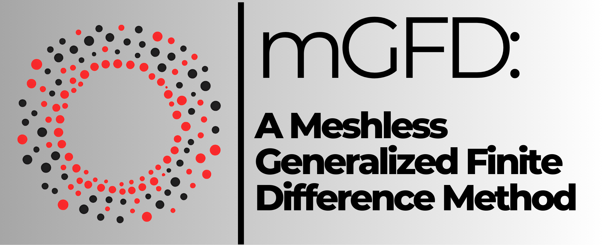
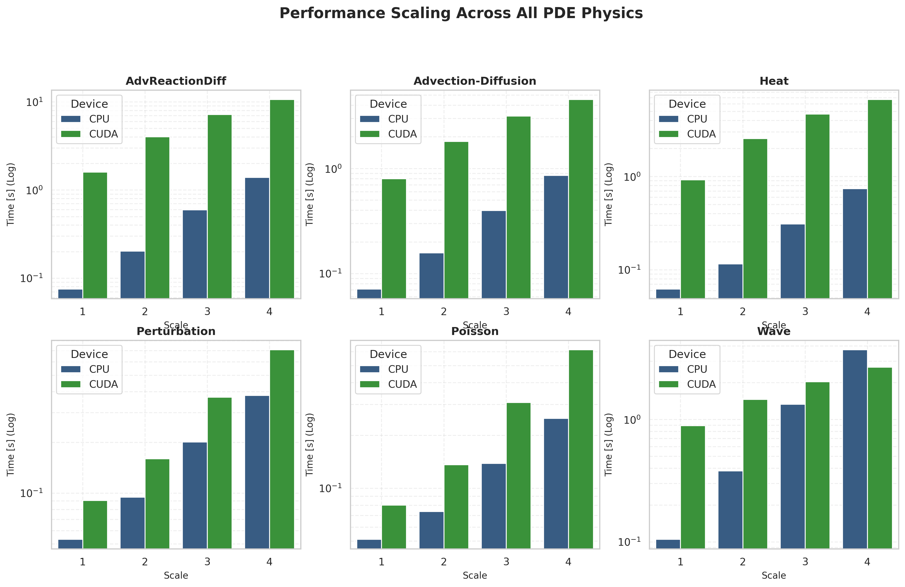
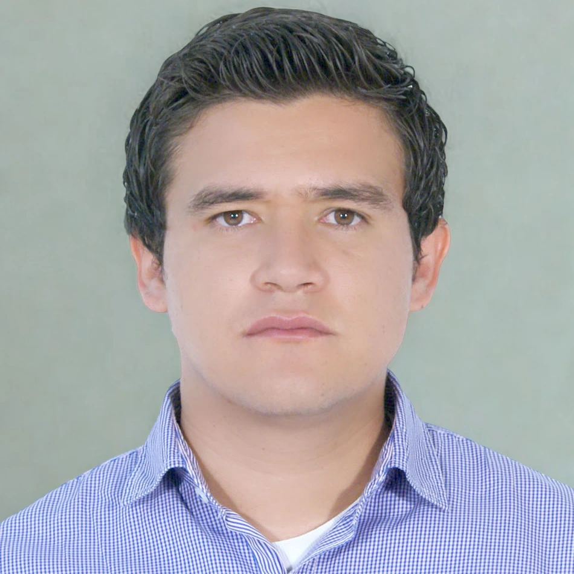
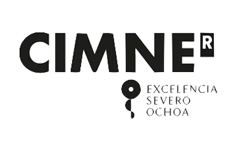

# mGFD Research Laboratory :microscope:

<div align="center">



**Experimental tools, benchmarks, visualizations, and reference datasets for the mGFD method.**

### :link: Quick Links
[](METHODOLOGY.md) [](DATASETS.md) [](RESULTS.md) [](#scientist-research-team) [](#factory-industry-partners--sponsorships)

</div>

---

## :clipboard: Table of Contents
- [📚 Scientific Documentation](#books-scientific-documentation)
- [📈 Experiment Reproduction](#chart_with_upwards_trend-experiment-reproduction)
- [📊 Computational Performance Profile](#bar_chart-computational-performance-profile)
- [👥 Research Team](#scientist-research-team)
- [🏭 Industry Partners & Sponsorships](#factory-industry-partners--sponsorships)
- [📄 Scientific References](#books-scientific-references)

---

This directory contains the entire suite of experimental tools, benchmarks, visualizations, and original datasets (real lakes) that support the scientific publication of the mGFD method.

Unlike the project root (which functions as the installable Python package), this folder (`/research/`) is the **research laboratory** where scripts consume the `mGFD` library to generate geographic studies and numerical stability analyses.

---

## :books: Scientific Documentation

To maintain readability, the deep scientific details of the laboratory are divided into specialized markdown files. Please visit the following pages for comprehensive information:

*   **[🧮 Mathematical Methodology (METHODOLOGY.md)](METHODOLOGY.md)**: Detailed derivations of the mGFD scheme, Taylor expansions, consistency conditions, and the Upwind stabilization scheme.
*   **[🗂️ Benchmark Datasets (DATASETS.md)](DATASETS.md)**: A complete catalog of the 20 real-world geographic point clouds, density scaling (1-4), exact node census across all geometries, and KD-Tree stencil structures.
*   **[🎬 Experimental Results (RESULTS.md)](RESULTS.md)**: Visual demonstrations, error bounds, and hardware speedups for the 6 families of Partial Differential Equations (Poisson, Perturbation, Heat, Advection-Diffusion, AdvReactionDiff, Wave).

---

## :chart_with_upwards_trend: Experiment Reproduction

To reproduce the results generated in the scientific publications, or to generate massive performance benchmarks across all available point clouds, you can use the centralized parameter sweep orchestrator:

```bash
# Move to the research/codes directory
cd research/codes

# Run all experiment batches at once
python sweep.py
```

### ⚙️ High-Performance Configuration (`sweep_config.json`)

The orchestrator reads `codes/sweep_config.json` to generate a combinatorial execution matrix. It supports **parallel CPU worker processes (`cpu_workers: 2`)** and **concurrent CUDA GPU execution (`parallel: true`)**:

```json
{
    "runners": [
        "run_Poisson.py",
        "run_AdvReactionDiff.py",
        "run_Wave.py"
    ],
    "scales": ["1", "2", "3", "4"],
    "nvec": [16],
    "device": ["cpu", "cuda"],
    "upwind": [true, false],
    "save": false,
    "cfl": [0.1],
    "damping": [0.0],
    "alpha": [0.0],
    "parallel": true,
    "cpu_workers": 2
}
```

> [!TIP]
> **Benchmarking GPU vs CPU in Parallel:** Adding `"cuda"` and `"cpu"` to the `"device"` array with `"parallel": true` runs CPU worker processes concurrently alongside the CUDA GPU worker, cutting total parameter sweep execution time in half (**~2x speedup**).

> [!NOTE]
> **Performance Scaling:** On fine meshes ($m > 12,000$ to $37,000$ nodes), CUDA GPU solvers deliver **up to 4.0x speedups** over CPU solves in transient wave propagation.

The raw metrics are exported as JSON files inside `results/`. **However, for your convenience, `sweep.py` will automatically crawl all generated JSONs at the end of the execution and compile a master `sweep_summary_YYYYMMDD_HHMMSS.csv` inside the `results/` folder.** This file contains a tabular view of all combinations (Equation, Scale, Device, Matrix-Free, Time, Error, etc.), making it incredibly easy to plot and analyze CPU vs GPU performance.

To produce publication-grade analytical figures from any sweep summary CSV, run the plotting orchestrator:
```bash
python codes/utils/plot_sweep.py
```
This generates 6 specialized visualization categories inside `results/sweep_plots/` (scaling, speedup, convergence, per-step efficiency, upwind impact, and geometric breakdowns).

---

## :bar_chart: Computational Performance Profile

The `mGFD` suite is rigorously benchmarked. The following visual profile and data table summarize **1,440 automated tests** evaluating 6 families of equations across 20 distinct geographic point clouds and 4 density scales on both CPU and CUDA GPU hardware backends.

<div align="center">
  <br/>
  <sub>Averaged execution time and scaling per PDE family across all 20 unstructured lake geometries</sub>
</div>

### :bar_chart: Global Averages (Summary)

| Equation | Type / Physics | :stopwatch: Mean CPU Time (s) | :zap: Mean CUDA Time (s) | :triangular_ruler: Median Error (RMSE) | Scale 4 GPU Speedup |
|:---|:---|:---:|:---:|:---:|:---:|
| **Poisson** | Elliptic (Stationary) | `0.128` | `0.285` | `5.34e-06` | 0.57x |
| **Perturbation** | Multilayer Elliptic | `0.182` | `0.332` | `2.43e-06` | 0.63x |
| **Heat** | Parabolic Diffusion | `0.308` | `3.712` | `3.92e-07` | 0.37x |
| **Advection-Diffusion** | Advective Transient | `0.372` | `2.577` | `3.32e-05` | 0.60x |
| **AdvReactionDiff** | Forcing + Reaction | `0.567` | `5.875` | `3.46e-04` | 0.40x |
| **Wave** | Hyperbolic Oscillation | `1.386` | `1.769` | `1.74e-04` | **3.99x (Max) / 1.40x (Mean)** |

*Note: Computations rely on sparse KD-Tree stencils and the `scipy.sparse` / `cupy.sparse` backends.*

## :scientist: Research Team

<div align="center">

### :star2: Meet the Team
*Researchers and graduate students advancing meshless computational methods*

</div>

### :busts_in_silhouette: Main Researchers

<table align="center" width="100%" cellspacing="14">
  <tr>
    <td width="50%" valign="top" align="center">
      <div style="border: 1px solid #d0d7de; border-radius: 12px; padding: 20px; height: 100%;">
        <br/>
        <b>Dr. Gerardo Tinoco Guerrero</b> :mexico:<br/>
        <sub>Numerical Methods & Computational Mathematics</sub><br/><br/>
        <a href="http://www.siiia.com.mx"></a>
        <a href="http://www.umich.mx"></a><br/><br/>
        <a href="mailto:gerardo.tinoco@umich.mx"></a>
        <a href="https://orcid.org/0000-0003-3119-770X"></a>
        <a href="https://www.researchgate.net/profile/Gerardo-Tinoco-Guerrero"></a>
      </div>
    </td>
    <td width="50%" valign="top" align="center">
      <div style="border: 1px solid #d0d7de; border-radius: 12px; padding: 20px; height: 100%;">
        <br/>
        <b>Dr. Francisco Javier Domínguez Mota</b> :mexico:<br/>
        <sub>Applied Mathematics & Finite Difference Methods</sub><br/><br/>
        <a href="http://www.siiia.com.mx"></a>
        <a href="http://www.umich.mx"></a><br/><br/>
        <a href="mailto:francisco.mota@umich.mx"></a>
        <a href="https://orcid.org/0000-0001-6837-172X"></a>
        <a href="https://www.researchgate.net/profile/Francisco-Dominguez-Mota"></a>
      </div>
    </td>
  </tr>
  <tr>
    <td width="50%" valign="top" align="center">
      <div style="border: 1px solid #d0d7de; border-radius: 12px; padding: 20px; height: 100%;">
        <br/>
        <b>Dr. José Alberto Guzmán Torres</b> :mexico:<br/>
        <sub>Engineering Applications & Artificial Intelligence</sub><br/><br/>
        <a href="http://www.siiia.com.mx"></a>
        <a href="http://www.umich.mx"></a><br/><br/>
        <a href="mailto:jose.alberto.guzman@umich.mx"></a>
        <a href="https://orcid.org/0000-0002-9309-9390"></a>
        <a href="https://www.researchgate.net/profile/Jose-Guzman-Torres"></a>
      </div>
    </td>
    <td width="50%" valign="top" align="center">
      <div style="border: 1px solid #d0d7de; border-radius: 12px; padding: 20px; height: 100%;">
        <br/>
        <b>Dr. Heriberto Árias Rojas</b> :mexico:<br/>
        <sub>Engineering Applications</sub><br/><br/>
        <a href="http://www.siiia.com.mx"></a>
        <a href="http://www.umich.mx"></a><br/><br/>
        <a href="mailto:heriberto.arias@umich.mx"></a>
        <a href="https://orcid.org/0000-0002-7641-8310"></a>
        <a href="https://www.researchgate.net/profile/Heriberto-Arias-Rojas"></a>
      </div>
    </td>
  </tr>
</table>

### :mortar_board: Ph.D. Research Students

<table align="center" width="100%" cellspacing="14">
  <tr>
    <td width="50%" valign="top" align="center">
      <div style="border: 1px solid #d0d7de; border-radius: 12px; padding: 20px; height: 100%;">
        <br/>
        <b>Gabriela Pedraza-Jiménez</b><br/>
        <br/><br/>
        <a href="http://www.umich.mx"></a><br/><br/>
        <a href="mailto:2220157h@umich.mx"></a>
      </div>
    </td>
    <td width="50%" valign="top" align="center">
      <div style="border: 1px solid #d0d7de; border-radius: 12px; padding: 20px; height: 100%;">
        <br/>
        <b>Eli Chagolla-Inzunza</b><br/>
        <br/><br/>
        <a href="http://www.umich.mx"></a><br/><br/>
        <a href="mailto:1137626b@umich.mx"></a>
      </div>
    </td>
  </tr>
</table>

### :mortar_board: M.Sc. Research Students

<table align="center" width="100%" cellspacing="14">
  <tr>
    <td width="50%" valign="top" align="center">
      <div style="border: 1px solid #d0d7de; border-radius: 12px; padding: 20px; height: 100%;">
        <br/>
        <b>Jorge L. González-Figueroa</b><br/>
        <br/><br/>
        <a href="http://www.umich.mx"></a><br/><br/>
        <a href="mailto:1718717h@umich.mx"></a>
      </div>
    </td>
    <td width="50%" valign="top" align="center">
      <div style="border: 1px solid #d0d7de; border-radius: 12px; padding: 20px; height: 100%;">
        <br/>
        <b>Christopher N. Magaña-Barocio</b><br/>
        <br/><br/>
        <a href="http://www.umich.mx"></a><br/><br/>
        <a href="mailto:1339846k@umich.mx"></a>
      </div>
    </td>
  </tr>
</table>

### :mortar_board: Undergraduate Research Students

<table align="center" width="50%" cellspacing="14">
  <tr>
    <td width="100%" valign="top" align="center">
      <div style="border: 1px solid #d0d7de; border-radius: 12px; padding: 20px; height: 100%;">
        <br/>
        <b>Maria Goretti Fraga-Lopez</b><br/>
        <br/><br/>
        <a href="http://www.umich.mx"></a><br/><br/>
        <a href="mailto:1702174b@umich.mx"></a>
      </div>
    </td>
  </tr>
</table>

</div>

---

## :factory: Industry Partners & Sponsorships

<div align="center">

*Collaboration between academia, government, and industry to accelerate real-world impact*

<table align="center" width="100%" cellspacing="14">
  <tr>
    <td width="50%" valign="top" align="center">
      <div style="border: 1px solid #d0d7de; border-radius: 12px; padding: 20px; height: 100%;">
        <br/>
        <b>🔬 SECIHTI</b><br/>
        <sub>Science, Humanities, Technology & Innovation</sub><br/><br/>
        <a href="https://conahcyt.mx/"></a>
        
        <br/><br/>
        <b>Role:</b> Financial support and research grants<br/>(Project 1022677)
      </div>
    </td>
    <td width="50%" valign="top" align="center">
      <div style="border: 1px solid #d0d7de; border-radius: 12px; padding: 20px; height: 100%;">
        <br/>
        <b>🏭 SIIIA MATH</b><br/>
        <sub>Soluciones de Ingeniería, México</sub><br/><br/>
        <a href="http://www.siiia.com.mx"></a>
        
        <br/><br/>
        <b>Role:</b> Technology transfer, applied R&D, and computational infrastructure
      </div>
    </td>
  </tr>
  <tr>
    <td width="50%" valign="top" align="center">
      <div style="border: 1px solid #d0d7de; border-radius: 12px; padding: 20px; height: 100%;">
        <br/>
        <b>🎓 UMSNH</b><br/>
        <sub>Universidad Michoacana de S.N.H.</sub><br/><br/>
        <a href="http://www.umich.mx"></a>
        
        <br/><br/>
        <b>Role:</b> Academic collaboration, research infrastructure, and graduate formation
      </div>
    </td>
    <td width="50%" valign="top" align="center">
      <div style="border: 1px solid #d0d7de; border-radius: 12px; padding: 20px; height: 100%;">
        <br/>
        <b>🌿 Aula CIMNE-Morelia</b><br/>
        <sub>Research collaboration space</sub><br/><br/>
        <a href="https://aulas.cimne.com/aula/aula-morelia/"></a>
        
        <br/><br/>
        <b>Role:</b> Numerical methods environment and academic-industry collaboration
      </div>
    </td>
  </tr>
</table>

</div>

---

## :books: Scientific References

If you use this laboratory or the **mGFD method** in your research, please cite the primary mathematical formulation:

1. **Tinoco-Guerrero, G.**, Domínguez-Mota, F. J., Pedraza-Jiménez, G., Guzmán-Torres, J. A., & Tinoco-Ruiz, J. G. (2025). *"mGFD: A meshless generalized finite difference method"*. **Computers and Mathematics with Applications**, 195, 396-418. [DOI: 10.1016/j.camwa.2025.07.034](https://doi.org/10.1016/j.camwa.2025.07.034)

### Related Publications

2. **Pedraza-Jiménez, G.**, Tinoco-Guerrero, G., Domínguez-Mota, F. J., Guzmán-Torres, J. A., & Tinoco-Ruiz, J. G. (2025). *"mGFD: CloudGenerator"*. **Software Impacts**, 23, 100721. [DOI: 10.1016/j.simpa.2024.100721](https://doi.org/10.1016/j.simpa.2024.100721)
3. **Tinoco-Guerrero, G.**, Arias-Rojas, H., Guzmán-Torres, J. A., Román-Gutiérrez, R., & Tinoco-Ruiz, J. G. (2023). *"A meshless finite difference scheme applied to the numerical solution of wave equation in highly irregular space regions"*. **Computers & Mathematics with Applications**, 136, 25-33. [DOI: 10.1016/j.camwa.2023.01.035](https://doi.org/10.1016/j.camwa.2023.01.035)
4. **Tinoco-Guerrero, G.**, Domínguez-Mota, F. J., Guzmán-Torres, J. A., Román-Gutiérrez, R., & Tinoco-Ruiz, J. G. (2023). *"Study of the stability of a meshless generalized finite difference scheme applied to the wave equation"*. **Frontiers in Applied Mathematics and Statistics**, 9, 1214022. [DOI: 10.3389/fams.2023.1214022](https://doi.org/10.3389/fams.2023.1214022)
5. **Tinoco-Guerrero, G.**, Domínguez-Mota, F. J., Guzmán-Torres, J. A., & Tinoco-Ruiz, J. G. (2022). *"Numerical solution of diffusion equation using a method of lines and generalized finite differences"*. **Revista Internacional de Métodos Numéricos para Cálculo y Diseño en Ingeniería**, 38(2), 24. [DOI: 10.23967/j.rimni.2022.06.003](https://doi.org/10.23967/j.rimni.2022.06.003)

### BibTeX Citation

```bibtex
@article{tinoco2025mgfd,
  title={mGFD: A meshless generalized finite difference method},
  author={Tinoco-Guerrero, Gerardo and Domínguez-Mota, Francisco Javier and Pedraza-Jiménez, Gabriela and Guzmán-Torres, José Alberto and Tinoco-Ruiz, José Gerardo},
  journal={Computers and Mathematics with Applications},
  volume={195},
  pages={396--418},
  year={2025},
  publisher={Elsevier},
  doi={10.1016/j.camwa.2025.07.034}
}
```

<div align="center">
<i>Developed for the advancement of meshless numerical methods and scientific computing.</i><br/>
<a href="https://github.com/gstinoco/mGFD/issues">Report a Bug</a> | <a href="mailto:gerardo.tinoco@umich.mx">Contact Author</a>
</div>
