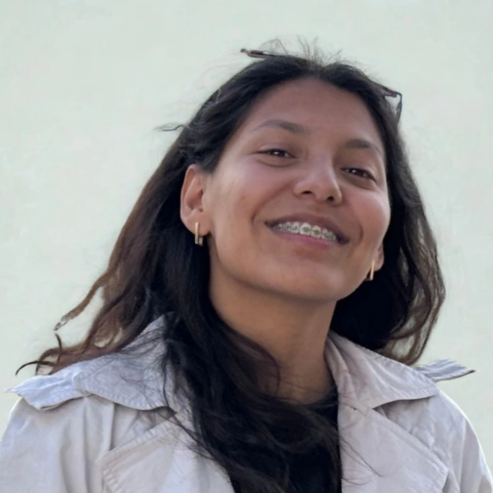

# mGFD Research Laboratory :microscope:

<div align="center">


**Experimental tools, benchmarks, visualizations, and reference datasets for the mGFD method.**

### :link: Quick Links
[](#books-mathematical-model) [](#file_cabinet-dataset-structure) [](#chart_with_upwards_trend-experiment-reproduction) [](#movie_camera-visualizations) [](#scientist-research-team) [](#building_with_garden-collaboration-centers)

</div>

---

## :clipboard: Table of Contents
- [Mathematical Model](#books-mathematical-model)
- [Laboratory Structure](#open_file_folder-laboratory-structure)
- [Dataset Structure](#file_cabinet-dataset-structure)
- [Visualizations](#movie_camera-visualizations)
- [Experiment Reproduction](#chart_with_upwards_trend-experiment-reproduction)
- [Acknowledgements and Sponsorships](#pray-acknowledgements-and-sponsorships)
- [Research Team](#scientist-research-team)
- [Scientific References](#books-scientific-references)

---

This directory contains the entire suite of experimental tools, benchmarks, visualizations, and original datasets (real lakes) that support the scientific publication of the mGFD method.

Unlike the project root (which functions as the installable Python package), this folder (`/research/`) is the **research laboratory** where scripts consume the `mGFD` library to generate geographic studies and numerical stability analyses.

---

## :books: Mathematical Model

The mGFD method solves operator-driven PDEs on an unstructured set of nodes. A representative stationary problem is written as:

$$A u_{xx} + B u_{xy} + C u_{yy} + D u_x + E u_y + F u = -f(x,y)$$

Where boundary values are imposed through $u = \phi(x,y)$ on the boundary nodes, and the interior unknowns are calculated using local generalized finite difference stencils built from neighbor sets.

---

## :open_file_folder: Laboratory Structure

```text
research/
├── Data/                         # Point cloud datasets (by region and scale)
├── Results/                      # Generated outputs (created when running scripts)
├── batches/                      # Reproducible reference experiments
│   ├── run_Poisson.py
│   ├── run_Heat.py
│   ├── run_AdvDif.py
│   ├── run_Wave.py
│   ├── run_Perturbation.py
│   ├── run_Perturbation2.py
│   └── benchmark.py
├── benchmark_results/            # Timing and memory results
└── main.py                       # Orchestrator that runs all batches sequentially
```

---

## :file_cabinet: Dataset Structure (`Data/`)

All datasets are taken from the Author's repository [Cloud-Generation](https://github.com/gstinoco/Cloud-Generation).

### Variants (`cloud` vs `cloud_exterior`)

For each region/scale you will find two variants of point clouds:
- `*_cloud.csv`: region without holes (either because there are no islands or because the islands were filled by adding interior nodes).
- `*_cloud_exterior.csv`: region with holes (the interior islands do not have a point cloud, so they are treated as empty regions).

### Available Geographic Regions

| Region                | Abbreviation |
|-----------------------|--------------|
| `Alchichica`          | ALC          |
| `Baikal`              | BAI          |
| `Balkhash`            | BAL          |
| `Caspian`             | CAS          |
| `Catemaco`            | CAT          |
| `Chapala`             | CHA          |
| `Huron`               | HUR          |
| `Patzcuaro`           | PAT          |
| `Poopo`               | POO          |
| `Santa Maria del Oro` | SMO          |
| `Titicaca`            | TIT          |
| `Yuriria`             | YUR          |
| `Zirahuen`            | ZIR          |

---

## :movie_camera: Visualizations

### :framed_picture: Example: Lake Poopo

<div align="center">

<table>
  <tr>
    <td align="center">
      <b>Cloud</b><br/>
      <sub>Data/Poopo/&lt;scale&gt;</sub><br/><br/>
      <br/>
    </td>
    <td align="center">
      <b>Cloud exterior (with islands/holes)</b><br/>
      <sub>Data/Poopo/&lt;scale&gt; (cloud_exterior)</sub><br/><br/>
      <br/>
    </td>
  </tr>
</table>

</div>

### :movie_camera: Transient Animations

<div align="center">

<table>
  <tr>
    <td align="center">
      <b>Heat (Cloud)</b><br/><br/>
      <br/>
      <a href="Results/Heat/Poopo/2x/cloud/"><code>Results/Heat/.../cloud/</code></a>
    </td>
    <td align="center">
      <b>Wave (Cloud exterior)</b><br/><br/>
      <br/>
      <a href="Results/Wave/Poopo/2x/cloud_exterior/"><code>Results/Wave/.../cloud_exterior/</code></a>
    </td>
  </tr>
</table>

</div>

---

## :chart_with_upwards_trend: Experiment Reproduction

To reproduce the results generated in the scientific publications, you can run the individual batches or the main orchestrator:

```bash
# Run all batches at once
python main.py

# Run a specific experiment
python batches/run_Poisson.py
```

### Performance Benchmarks

The benchmark suite measures execution time and memory usage:

```bash
pip install pandas psutil
python batches/benchmark.py
```

The results (CSVs and text reports) are deposited in `benchmark_results/`.

---

## :scientist: Research Team

<div align="center">

### :star2: Meet the Team
*Researchers and graduate students advancing meshless computational methods*

</div>

### :busts_in_silhouette: Main Researchers

<table align="center">
  <thead>
    <tr>
      <th align="center" width="120">Photo</th>
      <th align="left">Researcher</th>
      <th align="left">Affiliation</th>
      <th align="left">Contact</th>
    </tr>
  </thead>
  <tbody>
    <tr>
      <td align="center" width="120">
        
      </td>
      <td>
        <b>Dr. Gerardo Tinoco Guerrero</b> :mexico:<br/>
        <sub>Numerical Methods &amp; Computational Mathematics</sub>
      </td>
      <td>
        <a href="http://www.siiia.com.mx"></a><br/>
        <a href="http://www.umich.mx"></a>
      </td>
      <td>
        <a href="mailto:gerardo.tinoco@umich.mx"></a><br/>
        <a href="https://orcid.org/0000-0003-3119-770X"></a><br/>
        <a href="https://www.researchgate.net/profile/Gerardo-Tinoco-Guerrero"></a>
      </td>
    </tr>
    <tr>
      <td align="center" width="120">
        
      </td>
      <td>
        <b>Dr. Francisco Javier Domínguez Mota</b> :mexico:<br/>
        <sub>Applied Mathematics &amp; Finite Difference Methods</sub>
      </td>
      <td>
        <a href="http://www.siiia.com.mx"></a><br/>
        <a href="http://www.umich.mx"></a>
      </td>
      <td>
        <a href="mailto:francisco.mota@umich.mx"></a><br/>
        <a href="https://orcid.org/0000-0001-6837-172X"></a><br/>
        <a href="https://www.researchgate.net/profile/Francisco-Dominguez-Mota"></a>
      </td>
    </tr>
    <tr>
      <td align="center" width="120">
        
      </td>
      <td>
        <b>Dr. José Alberto Guzmán Torres</b> :mexico:<br/>
        <sub>Engineering Applications &amp; Artificial Intelligence</sub>
      </td>
      <td>
        <a href="http://www.siiia.com.mx"></a><br/>
        <a href="http://www.umich.mx"></a>
      </td>
      <td>
        <a href="mailto:jose.alberto.guzman@umich.mx"></a><br/>
        <a href="https://orcid.org/0000-0002-9309-9390"></a><br/>
        <a href="https://www.researchgate.net/profile/Jose-Guzman-Torres"></a>
      </td>
    </tr>
    <tr>
      <td align="center" width="120">
        
      </td>
      <td>
        <b>Dr. Heriberto Árias Rojas</b> :mexico:<br/>
        <sub>Engineering Applications</sub>
      </td>
      <td>
        <a href="http://www.siiia.com.mx"></a><br/>
        <a href="http://www.umich.mx"></a>
      </td>
      <td>
        <a href="mailto:heriberto.arias@umich.mx"></a><br/>
        <a href="https://orcid.org/0000-0002-7641-8310"></a><br/>
        <a href="https://www.researchgate.net/profile/Heriberto-Arias-Rojas"></a>
      </td>
    </tr>
  </tbody>
</table>

### :mortar_board: Ph.D. Research Students

<table align="center">
  <thead>
    <tr>
      <th align="center" width="120">Photo</th>
      <th align="left">Student</th>
      <th align="left">Institution</th>
      <th align="left">Contact</th>
    </tr>
  </thead>
  <tbody>
    <tr>
      <td align="center" width="120">
        
      </td>
      <td>
        <b>Gabriela Pedraza-Jiménez</b><br/>
        
      </td>
      <td>
        <a href="http://www.umich.mx"></a>
      </td>
      <td>
        <a href="mailto:2220157h@umich.mx"></a>
      </td>
    </tr>
    <tr>
      <td align="center" width="120">
        
      </td>
      <td>
        <b>Eli Chagolla-Inzunza</b><br/>
        
      </td>
      <td>
        <a href="http://www.umich.mx"></a>
      </td>
      <td>
        <a href="mailto:1137626b@umich.mx"></a>
      </td>
    </tr>
  </tbody>
</table>

### :mortar_board: M.Sc. Research Students

<table align="center">
  <thead>
    <tr>
      <th align="center" width="120">Photo</th>
      <th align="left">Student</th>
      <th align="left">Institution</th>
      <th align="left">Contact</th>
    </tr>
  </thead>
  <tbody>
    <tr>
      <td align="center" width="120">
        
      </td>
      <td>
        <b>Jorge L. González-Figueroa</b><br/>
        
      </td>
      <td>
        <a href="http://www.umich.mx"></a>
      </td>
      <td>
        <a href="mailto:1718717h@umich.mx"></a>
      </td>
    </tr>
    <tr>
      <td align="center" width="120">
        
      </td>
      <td>
        <b>Christopher N. Magaña-Barocio</b><br/>
        
      </td>
      <td>
        <a href="http://www.umich.mx"></a>
      </td>
      <td>
        <a href="mailto:1339846k@umich.mx"></a>
      </td>
    </tr>
  </tbody>
</table>

### :mortar_board: Undergraduate Research Students

<table align="center">
  <thead>
    <tr>
      <th align="center" width="120">Photo</th>
      <th align="left">Student</th>
      <th align="left">Institution</th>
      <th align="left">Contact</th>
    </tr>
  </thead>
  <tbody>
    <tr>
      <td align="center" width="120">
        
      </td>
      <td>
        <b>Maria Goretti Fraga-Lopez</b><br/>
        
      </td>
      <td>
        <a href="http://www.umich.mx"></a>
      </td>
      <td>
        <a href="mailto:1702174b@umich.mx"></a>
      </td>
    </tr>
  </tbody>
</table>

---

## :factory: Industry Partners Supporting Innovation

<div align="center">

### :star2: Industry Partners Supporting Innovation
*Collaboration between academia and industry to accelerate real-world impact*

</div>

<div align="center">

<table align="center" width="70%">
<tr>
<td align="center">

### :factory: **SIIIA MATH**
#### *Soluciones de Ingeniería, México*

<div align="center">

[](http://www.siiia.com.mx)
[](http://www.siiia.com.mx)
[](http://www.siiia.com.mx)

</div>

**🎯 Focus areas:**
- Mathematical modeling & simulation
- AI/ML engineering solutions
- Technology transfer and applied R&amp;D

<div align="center">

[](mailto:gtinoco@siiia.com.mx)

</div>

</td>
</tr>
</table>

</div>

---

## :books: Scientific References

### :books: Core Publications (GFD / mGFD Background)

1. **Tinoco-Guerrero, G.**, Domínguez-Mota, F. J., Guzmán-Torres, J. A., & Tinoco-Ruiz, J. G. (2022). *"Numerical Solution of Diffusion Equation using a Method of Lines and Generalized Finite Differences."* **Revista Internacional de Métodos Numéricos para Cálculo y Diseño en Ingeniería**, 38(2). [DOI: 10.23967/j.rimni.2022.06.003](http://dx.doi.org/10.23967/j.rimni.2022.06.003)

### :trophy: Project Highlights

- **Meshless PDE solver core** for irregular 2D domains using Generalized Finite Differences (mGFD)
- **Reference datasets** (multiple regions, scales, and variants) enabling consistent method-to-method comparisons
- **Reproducible batch scripts** covering Poisson, Heat, Advection–Diffusion, and Wave equation families
- **Error analysis and benchmarks** with saved artifacts under `Results/` for validation and reporting

---

## :memo: Citation & License

If you use this repository in your research, please cite:

```bibtex
@software{tinoco2024mGFD,
  title={mGFD: Meshless Generalized Finite Differences for Partial Differential Equations},
  author={Tinoco-Guerrero, Gerardo and
          Domínguez-Mota, Francisco Javier and
          Guzmán-Torres, José Alberto and
          Arias-Rojas, Heriberto},
  year={2024},
  institution={Universidad Michoacana de San Nicolás de Hidalgo},
  organization={SIIIA MATH: Soluciones en ingeniería},
  url={https://github.com/gstinoco/mGFD},
  note={Meshless solver and reference datasets for irregular domains using generalized finite differences}
}
```

### :page_facing_up: License

This project is licensed under the **MIT License** (see [LICENSE](LICENSE)).

```
MIT License

Copyright (c) 2024 Gerardo Tinoco-Guerrero

Permission is hereby granted, free of charge, to any person obtaining a copy
of this software and associated documentation files (the "Software"), to deal
in the Software without restriction, including without limitation the rights
to use, copy, modify, merge, publish, distribute, sublicense, and/or sell
copies of the Software, and to permit persons to whom the Software is
furnished to do so, subject to the following conditions:

The above copyright notice and this permission notice shall be included in all
copies or substantial portions of the Software.

THE SOFTWARE IS PROVIDED "AS IS", WITHOUT WARRANTY OF ANY KIND, EXPRESS OR
IMPLIED, INCLUDING BUT NOT LIMITED TO THE WARRANTIES OF MERCHANTABILITY,
FITNESS FOR A PARTICULAR PURPOSE AND NONINFRINGEMENT. IN NO EVENT SHALL THE
AUTHORS OR COPYRIGHT HOLDERS BE LIABLE FOR ANY CLAIM, DAMAGES OR OTHER
LIABILITY, WHETHER IN AN ACTION OF CONTRACT, TORT OR OTHERWISE, ARISING FROM,
OUT OF OR IN CONNECTION WITH THE SOFTWARE OR THE USE OR OTHER DEALINGS IN THE
SOFTWARE.
```

---

## :pray: Acknowledgments

<div align="center">

### :heart: Special Thanks
*We extend our gratitude to the institutions and partners supporting this research and open-source development*

</div>

### :classical_building: Institutional Support

<table align="center" width="100%" cellspacing="14">
  <tr>
    <td width="50%" valign="top">
      <div style="border: 1px solid #d0d7de; border-radius: 12px; padding: 16px;">
        <div align="center">
          <b>🎓 Universidad Michoacana de San Nicolás de Hidalgo (UMSNH)</b><br/>
          <sub>Academic institution, Mexico</sub><br/><br/>
          <a href="http://www.umich.mx"></a>
          
          
        </div>
        <br/>
        <b>Key support</b>
        <ul>
          <li>Academic foundation and research infrastructure</li>
          <li>Scientific training and supervision environment</li>
        </ul>
      </div>
    </td>
    <td width="50%" valign="top">
      <div style="border: 1px solid #d0d7de; border-radius: 12px; padding: 16px;">
        <div align="center">
          <b>🏛️ Secretariat of Science, Humanities, Technology and Innovation (SECIHTI)</b><br/>
          <sub>State Secretariat, Mexico</sub><br/><br/>
          <a href="https://secihti.mx/"></a>
          
          
        </div>
        <br/>
        <b>Key support</b>
        <ul>
          <li>Support for science and technology initiatives</li>
          <li>Funding and innovation promotion</li>
        </ul>
      </div>
    </td>
  </tr>
  <tr>
    <td width="50%" valign="top">
      <div style="border: 1px solid #d0d7de; border-radius: 12px; padding: 16px;">
        <div align="center">
          <b>🌿 Centre Internacional de Mètodes Numèrics en Enginyeria (CIMNE)</b><br/>
          <sub>Industry, Spain</sub><br/><br/>
          <a href="https://aulas.cimne.com/aula/aula-morelia/"></a>
          
          
        </div>
        <br/>
        <b>Key support</b>
        <ul>
          <li>International collaboration in numerical methods</li>
          <li>Computational engineering research environment</li>
        </ul>
      </div>
    </td>
    <td width="50%" valign="top">
      <div style="border: 1px solid #d0d7de; border-radius: 12px; padding: 16px;">
        <div align="center">
          <b>🏭 SIIIA MATH: Soluciones en Ingeniería</b><br/>
          <sub>Industry, México</sub><br/><br/>
          <a href="http://www.siiia.com.mx"></a>
          
          
        </div>
        <br/>
        <b>Key support</b>
        <ul>
          <li>Industry-driven applied research and development</li>
          <li>Technology transfer and practical engineering impact</li>
        </ul>
      </div>
    </td>
  </tr>
</table>

### :building_with_garden: Research Centers & Collaborations

<div align="center">

<table align="center" width="100%" cellspacing="14">
  <tr>
    <td width="50%" valign="top">
      <div style="border: 1px solid #d0d7de; border-radius: 12px; padding: 16px;">
        <div align="center">
          <b>🌿 Aula CIMNE-Morelia</b><br/>
          <sub>Research collaboration space</sub><br/><br/>
          <a href="https://aulas.cimne.com/aula/aula-morelia/"></a>
          
          
        </div>
        <br/>
        <b>Collaboration highlights</b>
        <ul>
          <li>Numerical methods and computational engineering environment</li>
          <li>Academic–industry collaboration and training activities</li>
        </ul>
      </div>
    </td>
    <td width="50%" valign="top">
      <div style="border: 1px solid #d0d7de; border-radius: 12px; padding: 16px;">
        <div align="center">
          <b>🎓 UMSNH</b><br/>
          <sub>Academic collaboration</sub><br/><br/>
          <a href="http://www.umich.mx"></a>
          
          
        </div>
        <br/>
        <b>Collaboration highlights</b>
        <ul>
          <li>Institutional infrastructure supporting research and training</li>
          <li>Graduate formation and supervision for scientific computing</li>
        </ul>
      </div>
    </td>
  </tr>
</table>

</div>

### :computer: Technology Communities

<div align="center">

| :package: Framework | :busts_in_silhouette: Community | :star: Contribution |
|:---:|:---:|:---:|
| [](https://numpy.org/) | **NumPy Community** | Array computing foundation |
| [](https://scipy.org/) | **SciPy Community** | Numerical algorithms |
| [](https://matplotlib.org/) | **Matplotlib Community** | Scientific visualization |
| [](https://joblib.readthedocs.io/) | **Joblib Community** | Parallel computing utilities |

</div>

---


## :books: Scientific References

1. **Tinoco-Guerrero, G.**, Domínguez-Mota, F. J., Guzmán-Torres, J. A., & Tinoco-Ruiz, J. G. (2022). *"Numerical Solution of Diffusion Equation using a Method of Lines and Generalized Finite Differences."* **Revista Internacional de Métodos Numéricos para Cálculo y Diseño en Ingeniería**, 38(2). [DOI: 10.23967/j.rimni.2022.06.003](http://dx.doi.org/10.23967/j.rimni.2022.06.003)

If you use this laboratory in your research, please cite:

```bibtex
@software{tinoco2024mGFD,
  title={mGFD: Meshless Generalized Finite Differences for Partial Differential Equations},
  author={Tinoco-Guerrero, Gerardo and Domínguez-Mota, Francisco Javier and Guzmán-Torres, José Alberto and Arias-Rojas, Heriberto},
  year={2024},
  institution={Universidad Michoacana de San Nicolás de Hidalgo},
  organization={SIIIA MATH: Soluciones en ingeniería},
  url={https://github.com/gstinoco/mGFD},
  note={Meshless solver and reference datasets for irregular domains using generalized finite differences}
}
```

<div align="center">
<i>If this scientific laboratory helps in your research, consider giving a star ⭐️ to the main project!</i><br/><br/>
<i>Built with ❤️ by the scientific computing community in Morelia, México.</i><br/>
<a href="https://github.com/gstinoco/mGFD/issues">Report a Bug</a> | <a href="mailto:gerardo.tinoco@umich.mx">Contact Author</a>
</div>
