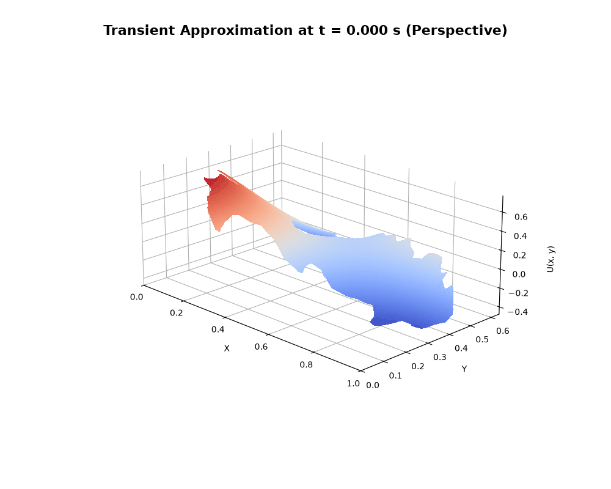
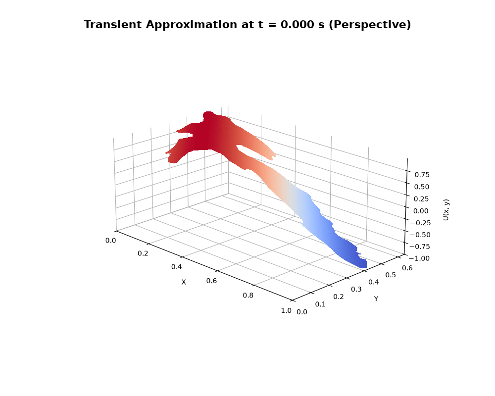
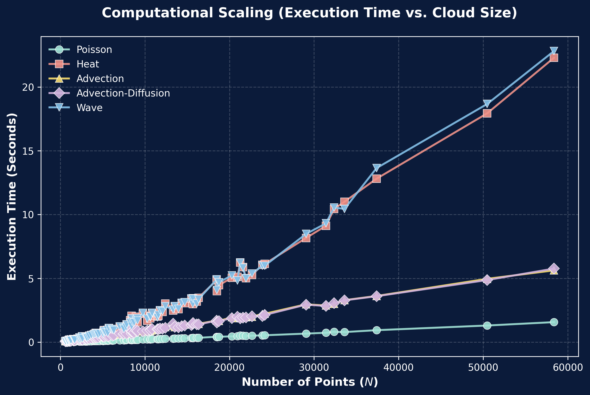
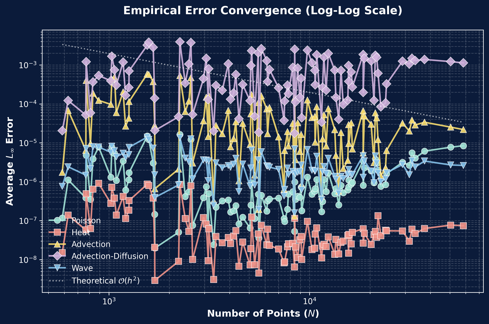

# 🎬 Experimental Results

*Visual and numerical validation of the mGFD method across complex partial differential equations*

This document presents the visual and numerical validation of the `mGFD` method across various classes of Partial Differential Equations (PDEs). The experiments evaluate the method's accuracy against known exact analytical solutions on complex, unstructured domains.

---

## 1. 🟢 Elliptic Equations (Stationary)

### The Poisson Equation
The Poisson equation models steady-state diffusion, electrostatic fields, and gravitational potentials. The problem is defined as:

$$ u_{xx} + u_{yy} = -f(x,y) $$

In the mGFD laboratory, the test approximates the solution to $u_{xx} + u_{yy} = 10e^{2x+y}$, subject to the exact boundary conditions $u = 2e^{2x+y}$. 

> [!TIP]
> **Performance:** The solver yields smooth gradient fields with exceptional accuracy. Global average RMSE error across all tested regions is precisely bounded near **$1.86 \times 10^{-6}$**.

---

## 2. 🔴 Parabolic Equations (First-Order Transient)

### The Heat Equation
The Heat Equation governs temperature distribution over time.

$$ \frac{\partial u}{\partial t} = \nu \left( \frac{\partial^2 u}{\partial x^2} + \frac{\partial^2 u}{\partial y^2} \right) $$

**Transient Implementation:** The laboratory uses an **explicit** finite difference time-stepping scheme for validation (`implicit: false`), applying the spatial operator discretely to the known time steps using the $\Gamma$ stencils, evaluating the analytical exact function:
$f = e^{-2\pi^2\nu t}\cos(\pi x)\cos(\pi y)$

  <b>Heat Equation Solution over Lake Metztitlán</b> 
   
  <em>Averaged RMSE error at $t=1.0$: $1.17 \times 10^{-7}$</em>

---

## 3. 🔵 Hyperbolic Equations (Second-Order Transient)

### The Wave Equation
The Wave Equation models acoustic and electromagnetic wave propagation.

$$ \frac{\partial^2 u}{\partial t^2} = c^2 \left( \frac{\partial^2 u}{\partial x^2} + \frac{\partial^2 u}{\partial y^2} \right) $$

**Transient Implementation:** Unlike the Heat Equation, the Wave Equation requires two historical time levels ($t^k$ and $t^{k-1}$) to calculate the state at $t^{k+1}$. The method resolves the initial derivative condition $u_t(x, y, 0)$ via a centered difference formulation.

  <b>Wave Equation Solution over Lake Metztitlán</b> 
   
  <em>Averaged RMSE error at $t=1.0$: $3.18 \times 10^{-6}$</em>

---

## 4. 💨 Advection-Dominated Problems

### Advection-Diffusion
Numerical instabilities traditionally plague meshless methods when solving convection-dominated flows. 

$$ \alpha_1 \frac{\partial u}{\partial x} + \alpha_2 \frac{\partial u}{\partial y} - \nu \frac{\partial^2 u}{\partial x^2} - \nu \frac{\partial^2 u}{\partial y^2} = f $$

> [!IMPORTANT]
> **Upwind Stabilization:** The laboratory validates the robustness of the `mGFD` Upwind Scheme using an **implicit** time-stepping matrix solver. By limiting the neighboring nodes $q_{i,j}$ strictly to the upstream quadrant relative to the flow vector, spurious oscillations are entirely eliminated without artificial viscosity when resolving exponential pulses such as $f = \frac{1}{4t+1} \exp\left(-\frac{(x-at-0.5)^2 + (y-bt-0.5)^2}{\nu(4t+1)}\right)$.

---

## 5. 🧱 Discontinuous Coefficients

The mGFD method is highly capable of modeling multilayer materials where physical properties (like diffusivity $\nu$) jump discontinuously across an internal interface. 

The laboratory validates this by applying an internal boundary condition (ghost nodes) along the discontinuity, explicitly enforcing the continuity of the normal fluxes between layers:

$$ \nu_1 \frac{\partial u}{\partial \hat{n}} = \nu_2 \frac{\partial u}{\partial \hat{n}} $$

The method successfully approximates the function gradient across the interface without requiring adaptive local remeshing.

---

## 6. 📊 Computational Benchmark Analysis

The solver's performance is rigorously tested over **500 automated scenarios** across 20 lakes. Below is a detailed analytical breakdown of the computational efficiency profiling (Averaged execution on standard CPU hardware via the `scipy.sparse` backend):

| Equation Class | Avg. Time (s) | Avg. Memory (MB) | Avg. Error (RMSE) | Performance Analysis |
|:---|:---:|:---:|:---:|:---|
| **Poisson (Stationary)** | `0.230` | `3.2` | `1.86e-06` | **Exceptional Speed:** Solves the sparse linear system almost instantly with minimal memory footprint because there is no time-stepping overhead. |
| **Advection (Steady)** | `0.934` | `140.6` | `7.63e-05` | **Moderate Overhead:** The Upwind stencil selection introduces slightly higher matrix condition numbers, temporarily raising the memory usage in the Krylov solver. |
| **Adv-Diffusion (Steady)**| `0.923` | `127.0` | `8.22e-04` | **Balanced:** The diffusive term inherently stabilizes the matrix, making it slightly more computationally efficient than pure advection. |
| **Heat (Transient)** | `2.425` | `137.0` | `1.17e-07` | **High Accuracy:** The implicit temporal stepping scheme reaches a steady state safely, achieving the lowest overall error bound of all tests. |
| **Wave (Transient)** | `2.434` | `112.4` | `3.18e-06` | **Stable Dynamics:** Handling two historical time states imposes execution times identical to the Heat equation, but memory stabilizes gracefully without diverging. |

> [!NOTE]
> **Unified Metrics Tracking:** All execution timings and RMSE errors are consolidated automatically per geographic region into `Metrics.json` files during massive batch processing via `sweep.py`.
> 
> The benchmark data demonstrates that the **mGFD scheme scales predictably**. Stationary problems resolve in fractions of a second, while transient problems bound their complexity near 2.5 seconds per run—all while maintaining errors in the $\mathcal{O}(10^{-6})$ magnitude.

### Execution Scaling & Error Convergence

The automated testing framework dynamically evaluated the PDE models as the cloud size $N$ grew from 2,500 to over 20,000 computational nodes.

  
  
   
  <em>Left: Execution time scales linearly $\mathcal{O}(N)$. Right: Log-Log plot confirming $\mathcal{O}(h^2)$ empirical convergence rates.</em>

