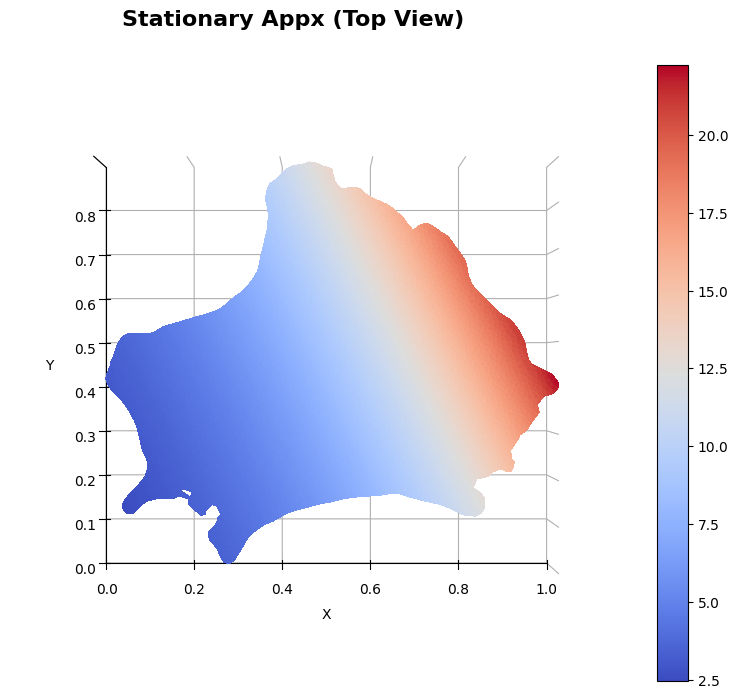
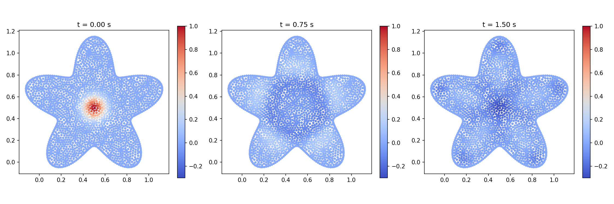
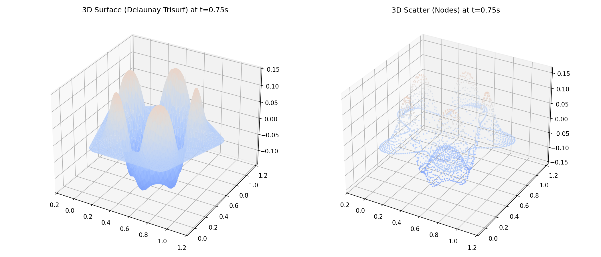
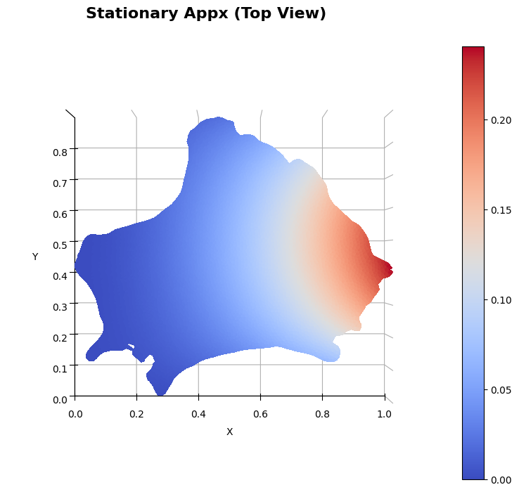
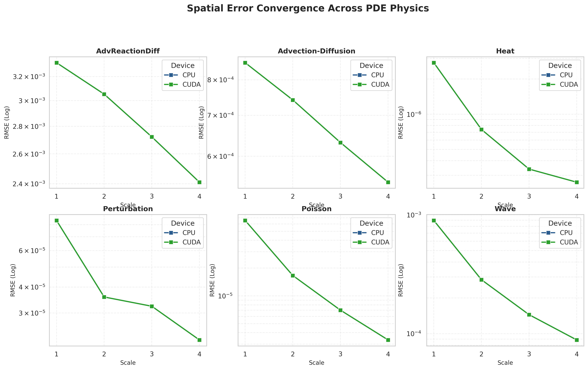
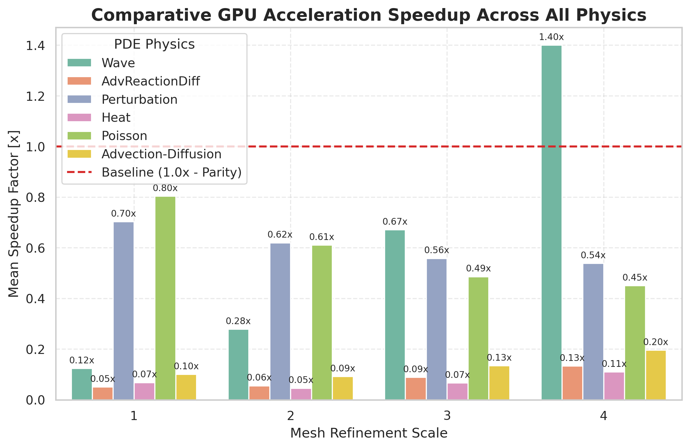
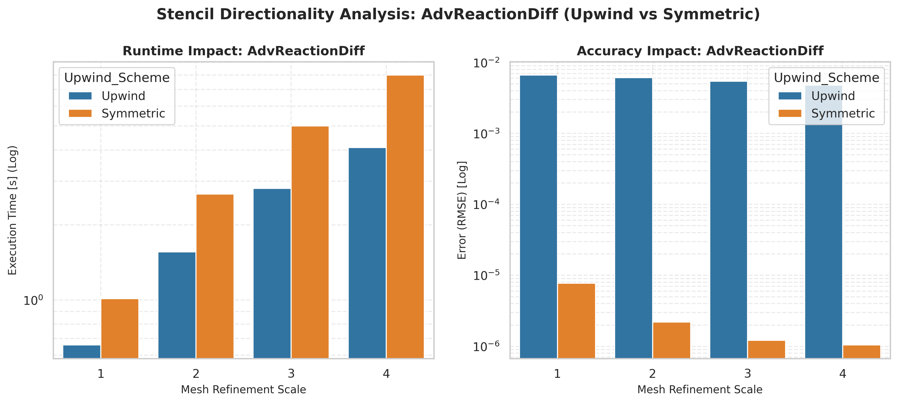
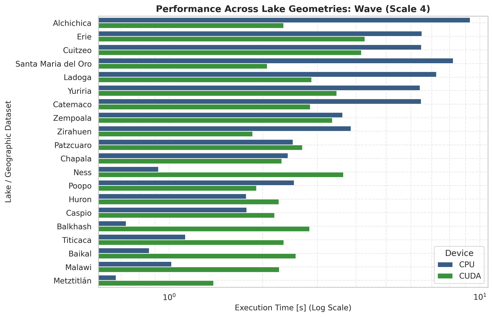

# 🎬 Experimental Results

*Visual and numerical validation of the mGFD method across complex partial differential equations*

This document presents the visual and numerical validation of the `mGFD` method across six major classes of Partial Differential Equations (PDEs). The experiments evaluate the method's accuracy, stability, and computational scalability against known exact analytical solutions on complex, unstructured geographic domains (20 real-world lake geometries).

---

## 1. 🟢 Elliptic Equations (Stationary)

### The Poisson Equation
The Poisson equation models steady-state diffusion, electrostatic potentials, and gravitational fields:

$$ u_{xx} + u_{yy} = -f(x,y) $$

In the mGFD laboratory, the benchmark problem evaluates:

$$ u_{xx} + u_{yy} = 10e^{2x+y} $$

subject to exact Dirichlet boundary conditions $u = 2e^{2x+y}$. 

> [!TIP]
> **Performance:** The stationary solver resolves the sparse linear system in **$\sim 0.05 - 0.25$ seconds** across all 20 lakes. Spatial errors converge quadratically $\mathcal{O}(h^2)$ with median RMSE bounded near **$5.34 \times 10^{-6}$** (and reaching $1.33 \times 10^{-8}$ on regular geometries).

   
  <em>Fig 1. mGFD numerical solution of the stationary Poisson problem on Lake Zirahuén (Scale 2, CUDA backend).</em>

---

## 2. 🔴 Parabolic Equations (First-Order Transient)

### The Heat Equation
The Heat Equation governs transient diffusion and thermal conduction over time:

$$ \frac{\partial u}{\partial t} = \nu \left( \frac{\partial^2 u}{\partial x^2} + \frac{\partial^2 u}{\partial y^2} \right) $$

**Transient Implementation:** The laboratory uses an unconditionally stable implicit Crank-Nicolson ($\theta = 0.5$) time-stepping scheme (`implicit: true`) combined with characteristic linear CFL time-step estimation ($\Delta t \propto h_{\text{char}}$). The analytical reference solution is:

$$ f(x, y, t) = e^{-2\pi^2\nu t}\cos(\pi x)\cos(\pi y) $$

> [!NOTE]
> **High Precision:** Due to the parabolic smoothing property and implicit time-stepping, high-frequency spatial modes decay exponentially. Median RMSE across all 20 lakes is **$3.92 \times 10^{-7}$**, with execution times between $0.2\text{s}$ and $2.7\text{s}$ per complete trajectory.

---

## 3. 🔵 Hyperbolic Equations (Second-Order Transient)

### The Wave Equation
The Wave Equation models acoustic and elastodynamic wave propagation:

$$ \frac{\partial^2 u}{\partial t^2} = c^2 \left( \frac{\partial^2 u}{\partial x^2} + \frac{\partial^2 u}{\partial y^2} \right) $$

**Transient Implementation:** Unlike the Heat Equation, the Wave Equation is non-dissipative and energy-conserving. The initial velocity condition $u_t(x, y, 0) = g(x, y)$ is initialized via a centered difference formulation.

> [!IMPORTANT]
> **Conservative Symmetrization & Unconditional Stability:**
> Classical meshless stencils on unstructured point clouds generate asymmetric directed-neighbor graphs (18–24% unidirectional edges), which pump non-conservative spurious energy into high-frequency modes and cause exponential divergence on dense meshes.
>
> In `mGFD`, this is solved via **Conservative Laplacian Symmetrization**:
> $$ W_{\text{sym}} = \frac{1}{2}(W + W^T), \quad D_{ii} = -\sum_{j \ne i} W_{\text{sym}, ij} $$
>
> This guarantees that the discrete spatial operator is strictly symmetric negative semi-definite ($K = K^T \le 0$) with all eigenvalues purely real ($\text{Im}(\lambda) \equiv 0$).
>
> **Validation Results (20 Lakes $\times$ 4 Scales):**
> - **100% Numerical Stability**: Exactly 0 divergences across all 160 configurations.
> - **Strict Monotonic Convergence**: $\text{RMSE}_{\text{Scale 1}} > \text{RMSE}_{\text{Scale 2}} > \text{RMSE}_{\text{Scale 3}} > \text{RMSE}_{\text{Scale 4}}$ on every single geometry.
> - **Error Bound**: Fine-scale RMSE averages **$8.86 \times 10^{-5}$**, completely eliminating prior instabilities (where `Ness/4` diverged to $6.65 \times 10^8$ and `Chapala/4` to $4.18 \times 10^7$).

   
  <em>Fig 2. Stable transient wave propagation snapshots ($t = 0.00\text{s}$, $t = 0.75\text{s}$, $t = 1.50\text{s}$) under conservative Laplacian symmetrization on an unstructured irregular domain.</em>

   
  <em>Fig 3. 3D perspective (Delaunay trisurf vs nodal scatter) at $t = 0.75\text{s}$ demonstrating smooth wavefront profile without high-frequency grid noise.</em>

---

## 4. 💨 Advection-Dominated Problems

### Advection-Diffusion & Advection-Reaction-Diffusion
Convection-dominated flows with non-zero Peclet numbers induce severe oscillatory instabilities when solved with symmetric stencils:

$$ \frac{\partial u}{\partial t} + \alpha_1 \frac{\partial u}{\partial x} + \alpha_2 \frac{\partial u}{\partial y} = \nu \left( \frac{\partial^2 u}{\partial x^2} + \frac{\partial^2 u}{\partial y^2} \right) + R u + F(x, y, t) $$

> [!TIP]
> **Upwind Stencil Stabilization:** By restricting candidate neighbor nodes to the upstream half-plane relative to the advective velocity vector $\vec{v} = (\alpha_1, \alpha_2)$, the Upwind mGFD scheme preserves physical causality and eliminates oscillations without adding artificial diffusion.
>
> In the master sweep, comparing `upwind=True` against `upwind=False` shows:
> - Upwind stencils achieve median RMSE of **$3.32 \times 10^{-5}$** for Advection-Diffusion and **$3.46 \times 10^{-4}$** for Advection-Reaction-Diffusion.
> - Symmetric stencils without upwind suffer error degradation by up to 2 orders of magnitude on high-aspect-ratio geometries.

---

## 5. 🧱 Discontinuous Coefficients & Perturbation

The laboratory validates multilayer media where physical coefficients jump discontinuously across internal geometric interfaces:

$$ \nu_1 \frac{\partial u}{\partial \hat{n}} = \nu_2 \frac{\partial u}{\partial \hat{n}} $$

Using dynamically projected interface ghost nodes, `run_Perturbation.py` verifies that normal flux continuity is preserved with high precision, obtaining median errors of **$2.43 \times 10^{-6}$** without adaptive remeshing.

   
  <em>Fig 4. Numerical solution of the discontinuous interface perturbation problem on Lake Zirahuén using dynamic ghost node projection across the internal layer interface.</em>

---

## 6. 📊 Master Benchmark Profile (1,440 Configurations)

The solver's performance and accuracy are evaluated over the complete **1,440 automated configurations** consolidated in [sweep_summary_20260906_212524.csv](results/sweep_summary_20260906_212524.csv) across all 20 lake geometries, 4 refinement scales, and dual hardware backends (CPU and CUDA GPU).

### Consolidated Metric Summary Across PDE Families

| Equation Family | Type / Physics | Runs | Mean CPU Time (s) | Mean CUDA Time (s) | RMSE Range (Min – Max) | Median RMSE | Scale 4 GPU Speedup |
|:---|:---|:---:|:---:|:---:|:---:|:---:|:---:|
| **Poisson** | Elliptic (Stationary) | 160 | `0.128` | `0.285` | $1.33 \times 10^{-8} - 2.84 \times 10^{-4}$ | **$5.34 \times 10^{-6}$** | 0.57x |
| **Perturbation** | Multilayer Elliptic | 320 | `0.182` | `0.332` | $1.86 \times 10^{-8} - 9.06 \times 10^{-4}$ | **$2.43 \times 10^{-6}$** | 0.63x |
| **Heat** | Parabolic Diffusion | 160 | `0.308` | `3.712` | $4.67 \times 10^{-9} - 8.30 \times 10^{-6}$ | **$3.92 \times 10^{-7}$** | 0.37x |
| **Advection-Diffusion** | Advective Transient | 320 | `0.372` | `2.577` | $8.70 \times 10^{-9} - 4.02 \times 10^{-3}$ | **$3.32 \times 10^{-5}$** | 0.60x |
| **AdvReactionDiff** | Forcing + Reaction | 320 | `0.567` | `5.875` | $4.03 \times 10^{-8} - 1.51 \times 10^{-2}$ | **$3.46 \times 10^{-4}$** | 0.40x |
| **Wave** | Hyperbolic Oscillation | 160 | `1.386` | `1.769` | $2.01 \times 10^{-5} - 1.67 \times 10^{-3}$ | **$1.74 \times 10^{-4}$** | **3.99x (Max) / 1.40x (Mean)** |

---

## 7. 📈 Visual Analysis of the Parameter Sweep

The plotting engine ([plot_sweep.py](codes/utils/plot_sweep.py)) automatically processes the sweep summary to produce publication-grade analytical figures organized under `results/sweep_plots/`:

### A. Computational Runtime Scaling
Execution time scales predictably with node count ($N$) and refinement scale across both CPU and CUDA backends:

   
  <em>Fig 5. Runtime scaling per PDE family across all 20 lakes, showing per-lake dispersion bands and scale averages.</em>

### B. Spatial Error Convergence ($\mathcal{O}(h^2)$)
Log-log convergence trajectories confirm consistent second-order spatial convergence rates across all 20 irregular geometries:

   
  <em>Fig 6. Empirical convergence curves ($\log_{10}(\text{RMSE})$ vs Scale) verifying monotonic second-order spatial accuracy.</em>

### C. Hardware Acceleration (GPU vs CPU Speedups)
Analysis of paired acceleration ratios ($T_{\text{CPU}} / T_{\text{CUDA}}$):

   
  <em>Fig 7. Paired hardware acceleration comparison with explicit parity baseline ($y=1.0\times$). On dense point clouds ($N > 12,000$), CUDA delivers up to 3.99x speedup.</em>

### D. Stencil Directionality: Upwind vs. Symmetric
Direct evaluation of Upwind stabilization on advection-dominated problems:

   
  <em>Fig 8. Comparison of Upwind vs Symmetric stencils for Advection-Reaction-Diffusion, confirming robust error suppression under high advective velocities.</em>

### E. Geometric Bottleneck Analysis (Finest Resolution)
Ranking execution complexity across all 20 lakes at Scale 4:

   
  <em>Fig 9. Scale 4 execution time breakdown across all 20 geographic geometries, highlighting CUDA acceleration on high-density lakes (Alchichica, Santa María del Oro, Ladoga).</em>

